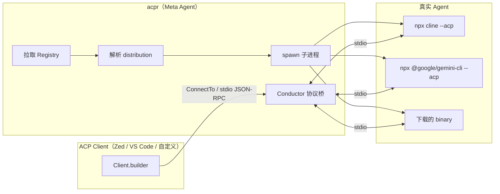

# acpr 项目分析

> 调研日期：2026-07-02  
> 仓库：[github.com/agentclientprotocol/acpr](https://github.com/agentclientprotocol/acpr)  
> 关联：[ACP 协议调研](./acp-agent-client-protocol-research.md)

---

## 1. 是什么

**acpr**（Agent Client Protocol Runner）是 ACP 生态里的 **Registry 启动器 + Meta Agent 适配层**：

1. 从官方 CDN 拉取 [ACP Registry](https://github.com/agentclientprotocol/registry) 聚合清单
2. 按条目解析分发方式（npm / PyPI / binary）
3. spawn 真实 Agent 子进程
4. 通过 Rust ACP SDK 的 **Conductor** 在 stdio 上跑完整 ACP 协议

官方描述为 *"experimental meta ACP agent"*。它**不是**编程 Agent 本身，而是「**任意注册 Agent 的统一 ACP 外壳**」。



### 在 ACP 生态中的位置

| 组件 | 职责 | acpr 的角色 |
|------|------|-------------|
| [agent-client-protocol](https://github.com/agentclientprotocol/agent-client-protocol) | 协议规范 + Rust schema | 依赖 `0.13` |
| [registry](https://github.com/agentclientprotocol/registry) | Agent 元数据与分发定义 | 数据源 |
| [rust-sdk](https://github.com/agentclientprotocol/rust-sdk) | `agent-client-protocol` + `conductor` | 协议运行时 |
| **acpr** | Registry → 命令 → ACP 会话 | 胶水层 |

与 MCP 的关系不变：acpr 只管「Client ↔ Agent」会话；MCP 仍由真实 Agent 直连工具。

---

## 2. 项目概况

| 项 | 值 |
|----|-----|
| 语言 | Rust 100% |
| 版本 | `0.3.0`（`Cargo.toml`） |
| 许可 | MIT OR Apache-2.0 |
| 体量 | ~21 commits，4 个源文件 + 5 个 example + 集成测试 |
| 成熟度 | **实验性**：无 GitHub Release，`cargo install acpr` 为主 |
| Stars | ~7（小众基础设施） |

### 源码结构

```
acpr/
├── src/
│   ├── cli.rs        # clap 参数（agent名、--list、--force、--cache-dir、--registry、--debug）
│   ├── registry.rs   # Registry 拉取/缓存/解析
│   ├── lib.rs        # 核心：Acpr、命令解析、二进制下载、ACP Conductor
│   └── main.rs       # CLI 入口
├── examples/         # sacp 集成、client 连接、bytestreams 等
├── tests/            # 集成测试（CI 默认跳过真实 Agent）
└── Cargo.toml
```

### 核心依赖

| Crate | 版本 | 用途 |
|-------|------|------|
| `agent-client-protocol` | 0.13 | ACP 类型 + `AcpAgent` / `Client` / `Stdio` |
| `agent-client-protocol-conductor` | 0.13 | `ConductorImpl` 协议生命周期 |
| `clap` | 4 | CLI 解析 |
| `reqwest` | 0.13 | Registry / binary 下载 |
| `tokio` | 1.52 | 异步 spawn、IO |
| `zip` / `tar` / `flate2` | — | 二进制解压 |

---

## 3. 核心工作流

### 3.1 CLI 模式

```bash
acpr cline          # 运行 registry 中的 cline
acpr --list         # 列出可用 agent
acpr --force all goose
```

`main.rs` 逻辑：

1. `--list` → `fetch_registry` → `list_agents` 打印彩色列表
2. 否则 → `Acpr::new(agent_name).run()` → 默认绑定进程 **stdin/stdout**

### 3.2 Registry 获取与缓存

`registry.rs` 默认从 CDN 拉取：

```
https://cdn.agentclientprotocol.com/registry/v1/latest/registry.json
```

| 机制 | 行为 |
|------|------|
| 缓存目录 | `dirs::cache_dir()/acpr/`（可用 `--cache-dir` 覆盖） |
| 缓存文件 | `registry.json` + `registry_cache.json`（时间戳） |
| 刷新策略 | **3 小时** TTL；`--force registry` 或 `--force all` 强制刷新 |
| 离线/私有 | `--registry <本地 JSON>` 跳过网络 |

### 3.3 三种分发方式

Registry 中每个 agent 的 `distribution` 决定 spawn 命令（见 [FORMAT.md](https://github.com/agentclientprotocol/registry/blob/main/FORMAT.md)）：

| 类型 | 解析结果 | 示例 |
|------|----------|------|
| **npx** | `npx -y <package> [args]` | `cline` → `npx -y cline@3.0.34 --acp` |
| **uvx** | `uvx <package> [args]` | `fast-agent` |
| **binary** | 按平台下载 zip/tar.gz/裸二进制 | `cursor`、`goose` 等 |

**版本处理**（`lib.rs`）：

- `@scope/pkg@1.2.3`（两个 `@`）→ 保留精确版本
- `cowsay` 等无版本 → 自动追加 `@latest`

**平台标识**：`darwin-aarch64`、`linux-x86_64`、`windows-x86_64` 等 6 种。

**二进制缓存**：`{cache_dir}/{agent_id}/{cmd}`；`--force binary` 强制重下；Unix 下 `chmod 755`。

### 3.4 ACP 协议桥接（关键设计）

解析出 `ResolvedCommand` 后，**不直接 exec 裸进程**，而是包装成 ACP Agent：

```rust
// lib.rs 核心逻辑（简化）
let mcp_server = McpServerStdio::new(&agent_name, &command)
    .args(args)
    .env(envs);
let acp_agent = AcpAgent::new(McpServer::Stdio(mcp_server));
let conductor = ConductorImpl::new_agent(&agent_name, AgentOnly(acp_agent));
conductor.run(Stdio::new()).await?;
```

含义：

1. acpr 对上游 Client 表现为 **一个 ACP Agent**（id = registry agent name）
2. 对下游通过 `McpServerStdio` spawn 真实 CLI，在子进程 stdio 上跑 ACP
3. `ConductorImpl` 处理 JSON-RPC 生命周期（initialize、session、prompt 等）

因此叫 **meta agent**：一层协议代理，背后可以是 cline、gemini、codex-acp 等任意注册项。

### 3.5 库 API（不仅 CLI）

| API | 用途 |
|-----|------|
| `Acpr::new(name).run()` | 默认 stdio，适合 `acpr gemini` 管道场景 |
| `run_with_streams(stdin, stdout)` | 自定义 IO（嵌入其他运行时） |
| `impl ConnectTo<Client>` | 可被 `Client.builder().connect_with(agent, ...)` 消费 |
| `with_command_wrapper(F)` | spawn 前改写命令（沙箱示例：`bwrap`） |

`CommandWrapper` 是重要扩展点：在 registry 解析之后、spawn 之前插入沙箱/环境隔离，而不改 registry。

```rust
// CommandWrapper trait
pub trait CommandWrapper {
    fn wrap(&self, cmd: ResolvedCommand) -> ResolvedCommand;
}

// 沙箱示例（tests 中 bwrap 演示）
Acpr::new("claude-acp").with_command_wrapper(|cmd| {
    ResolvedCommand {
        program: "bwrap".into(),
        args: vec!["--ro-bind", "/usr", "/usr", "--unshare-net", "--".into()]
            .chain(cmd.program).chain(cmd.args).collect(),
        envs: cmd.envs,
    }
})
```

---

## 4. Registry 数据示例

### cline

```json
{
  "id": "cline",
  "distribution": {
    "npx": {
      "package": "cline@3.0.34",
      "args": ["--acp"]
    }
  }
}
```

### gemini

```json
{
  "id": "gemini",
  "distribution": {
    "npx": {
      "package": "@google/gemini-cli@0.49.0",
      "args": ["--acp"]
    }
  }
}
```

Registry 仓库现有 **40+ agent**（claude-acp、codex-acp、cursor、opencode、goose、kimi、qwen-code、grok-build 等）。acpr 使用 CDN 聚合后的 `registry.json`，不是逐个读各目录下的 `agent.json`。

---

## 5. CLI 参数一览

| 参数 | 说明 |
|------|------|
| `<agent-name>` | 要运行的 registry agent id |
| `--list` | 列出可用 agent 及分发类型 |
| `--force all` | 强制刷新 registry + 重新下载 binary |
| `--force registry` | 仅强制刷新 registry |
| `--force binary` | 仅强制重新下载 binary |
| `--cache-dir <dir>` | 自定义缓存目录 |
| `--registry <file>` | 使用本地 registry JSON |
| `--debug` | stderr 输出 tracing DEBUG |

---

## 6. 测试与 CI

| 测试 | 覆盖 |
|------|------|
| `test_fetch_custom_registry` | 本地 fixture 解析 |
| `test_registry_caching` | 3 小时缓存逻辑 |
| `test_binary_caching` | 下载 + 缓存 + force |
| `test_versioned_package_handling` | npx 版本字符串 |
| `test_command_wrapper_*` | 沙箱包装 API |
| `test_amp_acp_integration` / `test_claude_integration` | 真实 agent ACP initialize |
| `test_uvx_agent_basic` | uvx agent 启动/退出 |

CI（`.github/workflows/ci.yml`）设 `ACPR_SKIP_AGENT=1`，只跑单元测试，避免 CI 拉 npm/跑真实 Agent。

本地完整验证：不设 `ACPR_SKIP_AGENT`，并安装 Node.js / uv 等工具链。

---

## 7. 设计评价

### 优点

1. **单一入口跑全生态**：Client 只需对接 acpr，不必为每个 Agent 写 spawn 逻辑
2. **与 Registry 稳定化对齐**：CDN + 3h 缓存，适合桌面 Client 分发
3. **Rust 原生 ACP**：直接用官方 `conductor`，比手写 JSON-RPC 更稳
4. **可嵌入**：`ConnectTo<Client>` + `run_with_streams` 支持 sacp/fast-agent 等框架集成
5. **沙箱钩子**：`CommandWrapper` 为安全场景预留接口

### 局限与风险

| 问题 | 说明 |
|------|------|
| **实验性** | 无 release、star 少，API 可能变 |
| **依赖外部工具链** | npx 要 Node，uvx 要 uv，binary 要网络下载 |
| **无认证/签名验证** | 下载 binary 信任 HTTPS + registry 策展，无额外签名校验 |
| **错误处理较粗** | `Agent not found`、平台不支持等直接向上抛 |
| **无进程池/会话复用** | 每次 `run()` 新 spawn；高并发 Client 需自建池 |
| **环境变量映射弱** | 不像 Clowder F161 的 `BUILTIN_ENV_MAPS`；API Key 靠用户 shell 环境 |
| **Windows** | 支持 `windows-x86_64`，但集成测试偏 Unix |

---

## 8. 与 Clowder AI（cat-cafe）的对比

| 维度 | acpr | Clowder F161 `AcpAgentService` |
|------|------|--------------------------------|
| 定位 | 通用 Registry 启动器 | 多猫 Hub 内的 ACP 传输层 |
| Agent 发现 | 官方 Registry CDN | `cat-config.json` 手写 variant |
| 协议栈 | Rust conductor | TS `@agentclientprotocol/sdk` + 自研 pool |
| 进程管理 | 单次 spawn | F149 进程池 / session lease / watchdog |
| Env 注入 | 无内置映射 | `acp-spawn-env.ts`、`BUILTIN_ENV_MAPS` |
| MCP 回传 | 无（纯 ACP 管道） | Cat Café MCP + callback 协作网 |
| 多 Agent 协作 | 不支持 | A2A、worklist、MCP post_message |

**结论**：acpr 解决「**怎么快速跑起来 registry 里任意 ACP agent**」；Clowder 解决「**多 Agent 在统一 Hub 里长期协作**」。二者可组合——例如用 acpr 作 spawn 层，外层再接 Clowder 的 pool/MCP，但需自建桥接。

### Clowder 相关源码

| 主题 | 路径 |
|------|------|
| 通用 ACP 传输 | `packages/api/src/domains/cats/services/agents/providers/acp/` |
| F161 规格 | `docs/features/F161-acp-carrier-generalization.md` |
| F149 进程池 | `docs/features/F149-acp-runtime-operations.md` |
| ACP 测试 | `packages/api/test/acp/` |

---

## 9. 典型使用场景

| 场景 | 是否适合 acpr |
|------|---------------|
| 本地试用 `acpr gemini` / `acpr cline` | ✅ 最快路径 |
| 编写 ACP Client 原型，`connect_with(Acpr::new("..."))` | ✅ examples 已演示 |
| IDE 插件动态 Agent 市场 | ✅ 与 Registry 战略一致 |
| 生产多租户 Agent 平台 | ⚠️ 需补 pool、auth、观测 |
| 多 Agent 互相 @、共享记忆 | ❌ 超出范围，需 Clowder 类系统 |

---

## 10. 安装与快速验证

```bash
# 安装（需 Rust toolchain）
cargo install acpr
# 或
cargo binstall acpr

# 列出 registry 中全部 agent
acpr --list

# 运行（需 Node.js + 网络）
acpr gemini

# 强制刷新 registry 后运行
acpr --force all cline

# 使用本地 registry（开发 / air-gap）
acpr --registry ./my-registry.json custom-agent
```

---

## 11. 总结

**acpr = Registry 驱动的 ACP Agent 启动器 + 协议 Conductor 包装器。**

价值在于把 [registry](https://github.com/agentclientprotocol/registry) 的「Agent 市场」变成可执行命令，让 Client 用统一方式接入 cline、gemini、codex-acp、cursor 等，而不必逐个维护 spawn 脚本。

当前仍是 **早期基础设施**（实验标签、无 release、CI 跳过真实 Agent 测试）。适合协议探索、Client 原型、本地试用；生产级多 Agent 平台仍需自补进程池、认证、env 映射、协作层——这正是 Clowder 在 F149/F161 做的事。

---

## 相关文档

| 文档 | 关系 |
|------|------|
| [acp-agent-client-protocol-research.md](./acp-agent-client-protocol-research.md) | ACP 协议全景调研 |
| [cat-cafe-tutorials-to-clowder-ai-mapping.md](./cat-cafe-tutorials-to-clowder-ai-mapping.md) | 教程第 01 课 Gemini ACP 路径 |
| [clowder-ai-architecture-analysis.md](./clowder-ai-architecture-analysis.md) | Clowder 平台全景 |