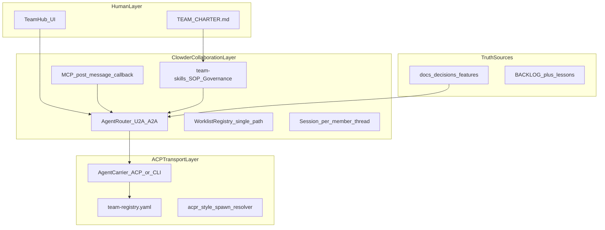

# Agent Team 建设方案（ACP + Clowder 融合）

> 制定日期：2026-07-02  
> 状态：草案，待执行  
> 关联：[ACP 调研](./acp-agent-client-protocol-research.md)、[acpr 分析](./acpr-project-analysis.md)、[Clowder 架构](./clowder-ai-architecture-analysis.md)、[教程对照](./cat-cafe-tutorials-to-clowder-ai-mapping.md)

---

## 目标与约束

已确认方向：

- **全能**：研发交付、调研决策、知识沉淀都要覆盖
- **融合**：ACP 做传输标准化，Clowder 做协作/治理/记忆
- **团队隐喻**：不用猫，用可读的专业角色（Architect / Engineer / Reviewer / Researcher）
- **可读性极强**：新人 30 分钟内能看懂「谁做什么、消息怎么流、文档在哪」

当前仓库 `team/` 仅有 `docs/` + `references/`，**尚无应用代码**。方案从「团队章程 + 最小可运行内核」起步，而非一次性 fork 全量 clowder-ai（45 章架构中约 60% 可 Phase 2 后再引入）。

---

## 核心架构：三层 + 双环



### 设计原则（来自教程血泪教训）

| 原则 | 来源 | 本团队怎么做 |
|------|------|--------------|
| 无 Boss Agent，判断与执行分离 | 教程第 12 课 | 角色对等 @；队列/Session 只是执行层，不做内容裁决 |
| A2A 单路径 worklist | 教程第 04 课 F027 | 禁止「callback 独立路由」双路径 |
| MCP 双通道 | 教程第 05 课 | CLI 思考私有；`post_message` 才进团队频道 |
| 文档是真相源 | 教程第 14 课 | 先 markdown + frontmatter，后 SQLite 索引 |
| Why-First 交接五件套 | 教程第 03 课 ADR-002 | 所有 handoff/review 必须附 Why |
| AC 不等于愿景 | 教程第 09 课 F041 | Review 强制回读原始 Discussion |

---

## 团队角色模型（替代三猫）

建议 **4 个核心成员 + 1 个可选**，每个角色一张「角色卡」写进 `team-registry/members.yaml`：

| 角色 ID | 职责 | 典型模型族 | 协作规则 |
|---------|------|------------|----------|
| `architect` | 价值澄清、架构、ADR | Claude 系 | 可 @reviewer 请求审查；不独自 merge |
| `engineer` | 实现、测试、修复 | Claude/Codex | 交付前必须 @reviewer |
| `reviewer` | 跨族 Review、安全、证物 Gate | Codex/GPT 系 | **禁止**与 engineer 同模型同任务自审 |
| `researcher` | 调研、竞品、创意、视觉 | Gemini 系 | 独立调研后再与 architect 对齐 |
| `operator`（可选） | 运维、脚本、 CI | 按订阅配置 | 仅执行层，不做产品判断 |

**可读性要求**：每个成员 YAML 含 `displayName`、`oneLineMission`、`whenToSummon`、`whenNotToSummon` 四字段——直接服务 UI 和 onboarding。

### members.yaml 示例

```yaml
members:
  - id: architect
    displayName: Architect
    oneLineMission: 澄清价值、定架构、写 ADR
    whenToSummon: 新 Feature 立项、架构分歧、愿景对照
    whenNotToSummon: 单行 bug fix、纯格式化
    clientId: anthropic
    protocol: acp          # 或 cli
    acp:
      command: claude
      args: ["--acp"]
    cli:
      command: claude
      args: ["--output-format", "stream-json"]
    envMap:
      ANTHROPIC_API_KEY: "${api_key}"
```

---

## 传输层：ACP + CLI 融合

参考 [acpr 分析](./acpr-project-analysis.md) 与 clowder F161（`references/clowder-ai/docs/features/F161-acp-carrier-generalization.md`）。

**Carrier 解析优先级**：

1. 成员配置 `protocol: acp` → `@agentclientprotocol/sdk` + 进程池（精简版 F149）
2. 否则 → CLI spawn + NDJSON（ADR-001，教程第 01 课）
3. 外部 Agent → 本地 `team-registry/external-agents.yaml`（仿 acpr `--registry`，不必依赖官方 CDN）

**不照搬 acpr 的部分**：进程池、env 映射、MCP 回传协作网——这些用 Clowder 模式自研在 Hub 内。

---

## 协作层：从 Clowder 精简借鉴的最小集

| 能力 | clowder 参考路径 | Phase | 说明 |
|------|------------------|-------|------|
| U2A @mention 路由 | `AgentRouter.ts` | 2 | 用户 @architect 触发 |
| A2A worklist 串行 | `route-serial.ts`, `a2a-mentions.ts` | 3 | 单路径 + `MAX_DEPTH=15` |
| MCP post_message | `callback-tools.ts` | 3 | 成员主动发言 |
| Session 隔离 | `SessionManager.ts` | 3 | `userId:memberId:threadId` |
| Invocation 状态机 | `invocation-state-machine.ts` | 4 | 防丢消息（教程第 06 课） |
| Skills 链 | `cat-cafe-skills/` → `team-skills/` | 1 | 改名 + 去猫术语 |
| SOP Delivery Loop | `sop-definitions/development.yaml` | 1 | Discovery→Delivery 文档化 |
| 记忆联邦 F102 | `KnowledgeResolver.ts` | 5 | 先用 grep + frontmatter，后 SQLite |
| Mission Hub | `mission-control/` | 5 | 先用 `BACKLOG.md` |
| IM 连接器 / Pack / World | 各 domain | 6+ | 明确不做进 MVP |

---

## 可读性体系（贯穿所有 Phase）

与 Cat Café 差异化的**第一优先级**：

1. **团队宪法** `docs/TEAM_CHARTER.md`：愿景、角色、成功标准、禁止事项（5 页以内）
2. **架构全景** `docs/ARCHITECTURE.md`：一张 mermaid + 术语表，链接到 [clowder 架构分析](./clowder-ai-architecture-analysis.md) 作 deep dive
3. **文档三层**（教程第 10 课）：`BACKLOG.md`（热）/ `docs/features/` 聚合（温）/ `docs/discussions/`（冷）
4. **frontmatter 契约**（ADR-011）：`stage`、`owner`、`feature_ids`——`scripts/check-frontmatter.mjs` 门禁
5. **7-slot 教训** `docs/lessons-learned.md`：每踩坑一条，禁止「随地拉 md」
6. **UI 文案**：Hub 显示「Architect 正在 Review」而非内部 provider id

---

## 仓库结构（待建）

```
team/
├── docs/
│   ├── TEAM_CHARTER.md          # 团队宪法
│   ├── ARCHITECTURE.md          # 可读全景
│   ├── agent-team-build-plan.md # 本文件
│   ├── decisions/               # ADR 起
│   ├── features/                # 一 Feature 一聚合文件
│   └── lessons-learned.md
├── team-registry/
│   ├── members.yaml             # 角色 + ACP/CLI 配置
│   └── external-agents.yaml     # 可选：第三方 Agent
├── team-skills/                 # 从 cat-cafe-skills 改写
│   ├── cross-handoff/
│   ├── request-review/
│   ├── merge-gate/
│   └── feat-lifecycle/
├── sop-definitions/
│   └── development.yaml
├── packages/                    # Phase 2 起
│   ├── api/
│   ├── web/
│   ├── mcp-server/
│   └── shared/
└── references/                  # clowder + tutorials
```

---

## 分阶段路线图

### Phase 0：定团队（1 周，零代码）

- [ ] 写 `docs/TEAM_CHARTER.md`
- [ ] 写 `team-registry/members.yaml`
- [ ] 从 `cat-cafe-skills` 改写 5 个核心 Skill 到 `team-skills/`
- [ ] 写 `docs/decisions/001-cli-acp-invocation.md`

**验收**：在 Cursor/Claude Code 里手动 @ 角色名 + Skill 跑通纸面「需求 → 实现 → Review」。

### Phase 1：治理先于平台（1–2 周）

- [ ] `sop-definitions/development.yaml`
- [ ] `team-skills/refs/shared-rules.md`
- [ ] `BACKLOG.md` + 第一个 Feature 聚合文件
- [ ] `check-frontmatter.mjs` + `check-dir-size.sh`

**验收**：不开 Hub，仅靠 Skills + git + markdown 完成一个小 Feature 闭环。

### Phase 2：最小 Team Hub（3–4 周）

- [ ] `packages/api`：Fastify + Redis + `AgentRouter`（仅 U2A）
- [ ] `packages/web`：单 Thread + 成员状态栏 + 角色卡设置
- [ ] `AgentCarrier`：ACP + CLI 双协议
- [ ] stderr 活跃检测、Redis 环境隔离

**验收**：一个界面 @architect / @engineer 并行响应。

### Phase 3：真正协作（2–3 周）

- [ ] Worklist 单路径 A2A（F027）
- [ ] `mcp-server` + `post_message` + token 认证
- [ ] Session per member per thread

**验收**：engineer 完成 → @reviewer → worklist 续跑，Stop 可终止全链。

### Phase 4：可靠性与可读观测（2 周）

- [ ] Invocation 状态机 + 队列持久化
- [ ] CLI 事件流可读面板
- [ ] merge gate 硬门禁

### Phase 5：记忆与任务（2–3 周）

- [ ] 文档真相源 + `feat_index` MCP + 简单 FTS
- [ ] BACKLOG → Thread 需求预注入
- [ ] lessons 晋升管道

### Phase 6：全能扩展（按需）

- [ ] 本地 `external-agents.yaml` 接入更多 ACP Agent
- [ ] IM 连接器、调度、审批——逐项 ADR 评估

---

## 与「直接 Fork clowder-ai」的对比

| 维度 | Fork clowder 改名 | 本方案 |
|------|-------------------|--------|
| 上线速度 | 快（功能全） | 慢（4–8 周 MVP） |
| 可读性 | 需大量去猫化/裁剪 | 从第一天按团队语言设计 |
| 技术债 | 继承 149+ Feature | 只引入验证过的内核 |
| ACP | 已有 F161，绑在 cat-config | ACP 作为一等公民 transport |
| 适合 | 快速体验全功能 | 打造**自己的**团队产品 |

**推荐**：Phase 0–1 在 `team/` 自研；Phase 2 起**选择性复制** clowder 文件（注明 LICENSE 来源），而非整库 fork。

---

## 关键风险与规避

| 风险 | 规避 |
|------|------|
| 双路径 A2A 灾难 | Phase 3 只实现 worklist 单路径 |
| F041 愿景漂移 | Review Skill 强制附 Discussion |
| Redis 误连丢数据 | 开发/生产端口隔离脚本先行 |
| 文档蜘蛛网 | 一 Feature 一聚合 + frontmatter 门禁 |
| ACP/CLI 双栈复杂 | `members.yaml` 单一真相源 |
| 「全能」范围膨胀 | Phase 6 功能必须写 ADR |

---

## 执行待办（总览）

| ID | 阶段 | 任务 |
|----|------|------|
| phase0-charter | 0 | TEAM_CHARTER + members.yaml |
| phase1-skills-sop | 1 | team-skills 五件套 + SOP + 门禁 |
| phase2-hub-mvp | 2 | api + web 最小 Hub |
| phase3-collab | 3 | A2A + MCP callback + Session |
| phase4-reliability | 4 | 状态机 + 观测 + merge gate |
| phase5-memory | 5 | 记忆轻量 + BACKLOG 注入 |
| docs-architecture | 贯穿 | ARCHITECTURE.md + lessons-learned |

---

## 下一步

确认本计划后，从 Phase 0 开始：

1. 创建 `docs/TEAM_CHARTER.md` 与 `team-registry/members.yaml` 草稿
2. 改写 5 个核心 Skill 到 `team-skills/`
3. 写 `docs/ARCHITECTURE.md` 一页纸全景