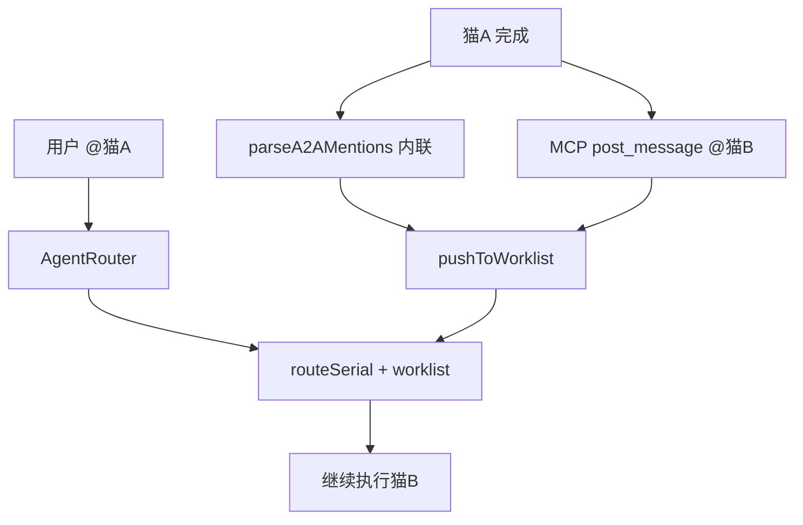
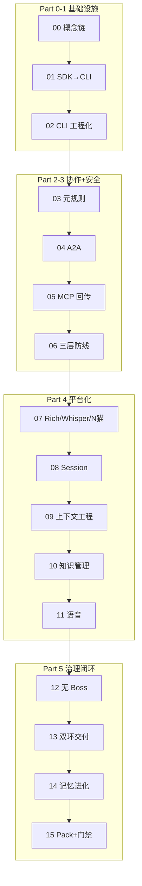

# Cat Café 教程 → Clowder AI 实现对照

> 将 `references/cat-cafe-tutorials` 全部课程与 `references/clowder-ai` 源码/规格一一映射。  
> 整理日期：2026-07-02

## 说明

| 项 | 内容 |
|----|------|
| **教程仓库** | `references/cat-cafe-tutorials/` — 见 [教程仓库全貌](#教程仓库全貌) |
| **实现仓库** | `references/clowder-ai`（npm 名 `cat-cafe`） |
| **Feature 编号** | 教程常写 `F27`；源码规格写 `F027`。本文并列标注 |
| **关系** | 教程讲「为什么 / 踩坑」；源码是「怎么做」的最终形态。教程之后仍有大量演进（F122、F192、F233 等） |
| **覆盖范围** | 16 正课全部章节 + 16 份作业（含内嵌）+ DEMO 27 项 + 附属 research/VISION/ADR |

---

## 目录

| 部分 | 内容 |
|------|------|
| [教程仓库全貌](#教程仓库全貌) | 除 lessons 外的附属文档 |
| [总览表](#总览表) | 16 课 + DEMO 27 项速查 |
| [Part 0–5](#part-0-第-00-课概念演进) | 第 00–15 课机制对照 |
| [各课章节级对照](#各课章节级对照) | 每课 `##` 章节 → 实现（不遗漏） |
| [DEMO 对照](#demo-功能演示对照) | DEMO.md 27 项 |
| [课后作业索引](#课后作业索引) | 16 份作业（含内嵌） |
| [Skills / ADR 索引](#skills-与课程对照) | 技能与架构决策 |
| [演进主线](#跨课演进主线) | 时间线 |
| [Feature 主索引](#教程-feature-主索引) | 教程出现的全部 F 号 |

---

## 教程仓库全貌

教程仓库**只有文档**，应用源码在 clowder-ai。除 `docs/lessons/` 外，下列文件也在本对照范围内：

| 路径 | 类型 | 与 clowder-ai 关系 |
|------|------|-------------------|
| `docs/lessons/README.md` | 教程目录 | 16 课索引；三只猫角色表 |
| `docs/lessons/DEMO.md` | 27 项演示 | 见 [DEMO 对照](#demo-功能演示对照) |
| `docs/lessons/00`–`15` + `*-homework.md` | 正课 + 作业 | 见各 Part 与 [章节级对照](#各课章节级对照) |
| `docs/VISION.md` | 愿景 | → `references/clowder-ai/docs/VISION.md`（同源演进） |
| `docs/decisions/001-agent-invocation-approach.md` | ADR-001 | → `clowder-ai/docs/decisions/001-*.md` |
| `docs/research/knowledge-enginnering/` | 知识工程研究 | → 第 09–10 课、`knowledge-engineering` Skill、`check-frontmatter.mjs` |
| `docs/research/knowledge-enginnering/knowledge-engineering-skills-mcp.md` | Skills+MCP 写作指南 | → `cat-cafe-skills/*/SKILL.md` 三件套规范 |
| `docs/research/knowledge-enginnering/templates.md` | 模板附录 | → Feature 聚合 frontmatter、`public-lessons.md` 7-slot |
| `docs/research/knowledge-enginnering/ragdoll-to-gpt-pro-*.md` | 外部评审 | → F046 反漂移、F041 教训背景 |

---

## 总览表

| 课 | 教程标题 | 核心机制 | 实现枢纽 |
|----|----------|----------|----------|
| **00** | AI Agent 概念演进 | Function Call → MCP → Skills → Agent | `cat-cafe-skills/`、`mcp-server/`、ADR-001/002/009 |
| **01** | SDK → CLI | CLI 子进程 + NDJSON | `cli-spawn.ts`、各 `*AgentService.ts`、ADR-001 |
| **02** | CLI 工程化 | stderr 活跃、Redis 隔离、诚实规则 | `cli-supervisor.ts`、`user-redis.sh`、F212 |
| **03** | 元规则 | 五件套、P1/P2/P3、Skill 门禁 | `shared-rules.md`、review/merge Skills、F011/F031 |
| **04** | A2A 路由 | Worklist 单路径、四层保障 | `a2a-mentions.ts`、`route-serial.ts`、F027 |
| **05** | MCP 回传 | 双通道、callback token、MCP 注入 | `callback-tools.ts`、`McpPromptInjector.ts`、F028 |
| **06** | 消失的 28 秒 | 三层防线：隔离/防腐/状态机 | F023/F025、`invocation-state-machine.ts` |
| **07** | 猫咖→平台 | Rich Blocks、PWA、Whisper、N 猫 | F022/F010/F032/F035、`rich.ts` |
| **08** | Session 管理 | Thread Affinity、Session Chain | `SessionManager.ts`、F024/F033/F225 |
| **09** | 上下文工程 | 四层解法、反漂移 | F042/F046/F049、`SystemPromptBuilder.ts` |
| **10** | 知识管理 | 三层记忆、frontmatter、Mission Hub | F040、ADR-011、`check-frontmatter.mjs` |
| **11** | 语音管线 | ASR→TTS→Voice Identity | F020/F066/F092/F103、`tts.ts` |
| **12** | 无 Boss Agent | 对等判断 + 结构化执行 | `QueueProcessor.ts`、F088/F139、ADR-002 |
| **13** | 一句话到交付 | Discovery + Delivery 双环 | SOP Skills、`pnpm gate`、F088 |
| **14** | 越犯错越聪明 | 文档真相源 + SQLite 联邦检索 | F102、`KnowledgeResolver.ts` |
| **15** | 54 天没崩 | Pack + 门禁 + 工程纪律 | F129、`PackCompiler.ts`、F114 |

---

## Part 0: 第 00 课（概念演进）

**教程**：`00-concepts-evolution.md`  
**核心问题**：Function Call → MCP → Skills → Agent 怎么演化来的？

### 教程概念 → 实现

| 演进阶段 | 教程要点 | clowder-ai 实现 |
|----------|----------|-----------------|
| Function Call / Tool Use | AI 选工具，程序执行 | 各 CLI 内置 tool_use；平台侧 MCP `cat_cafe_*` 工具 |
| MCP | 工具标准协议，一次开发到处用 | `packages/mcp-server/`（80+ 工具）；`server-toolsets.ts` ENV 白名单 |
| Skills | 渐进式披露，按任务加载 SOP | `cat-cafe-skills/`（48+ SKILL.md）；`manifest.yaml`；ADR-009 |
| Agent | 规划→执行→验证自主循环 | `AgentRouter` + `route-serial` + Skills 触发链 |
| RAG vs Agentic Search | 预索引 vs 实时 grep | `search_evidence` + `graph_resolve` + `list_recent`（F102/F188） |

### 关键路径

```
cat-cafe-skills/BOOTSTRAP.md
cat-cafe-skills/*/SKILL.md
packages/mcp-server/src/tools/
docs/decisions/001-agent-invocation-approach.md
docs/decisions/002-collaboration-protocol.md
docs/decisions/009-cat-cafe-skills-distribution.md
docs/VISION.md
```

---

## Part 1: 选型与架构（第 01–03 课）

### 第 01 课：SDK → CLI

**教程**：`01-sdk-to-cli.md`  
**核心问题**：为什么不用官方 SDK？

| 教程机制 | 实现 |
|----------|------|
| SDK 仅 API Key，无法用订阅额度 | ADR-001 决策 CLI-first |
| `spawnCli()` + NDJSON 解析 | `packages/api/src/utils/cli-spawn.ts` |
| Claude `stream-json` | `ClaudeAgentService.ts` + `claude-ndjson-parser.ts` |
| Codex `exec --json` | `CodexAgentService.ts` + `codex-event-transform.ts` |
| Gemini 双 Adapter（agy / gemini-cli） | `GeminiAgentService.ts`；ACP 路径 `AcpAgentService.ts`（`gemini --acp`） |
| MCP 回传弥补 CLI 程序化缺口 | `McpPromptInjector.ts` + `mcp-server` |

**后续演进**（教程未写，源码已有）：F159 native provider、F210 Antigravity 迁移、F161 通用 ACP carrier。

```
docs/decisions/001-agent-invocation-approach.md
docs/architecture/cli-integration.md
docs/features/F053-gemini-resume-session-parity.md
docs/features/F210-antigravity-cli-migration.md
docs/features/F161-acp-carrier-generalization.md
packages/api/src/domains/cats/services/agents/providers/
```

**课后作业** `01-homework.md`：最小 CLI spawn 示例 → 对照 `cli-spawn.ts` 测试 `cli-spawn.test.js`。

---

### 第 02 课：CLI 工程化

**教程**：`02-cli-engineering.md`  
**核心问题**：stderr、Redis 隔离、AI 幻觉

| 教程事故/机制 | 实现 |
|---------------|------|
| 只读 stdout → 误判超时 SIGKILL | `cli-spawn.ts`、`cli-supervisor.ts` 双流连通 |
| stderr = thinking/工具活跃信号 | `sanitize-cli-stderr.ts`；F212 CLI 诊断 |
| Redis 6399 生产 / 6398 开发隔离 | `scripts/user-redis.sh`、`derive-worktree-ports.mjs` |
| RDB 快照间隙丢数据 | `find-redis-dumps.sh`、`restore-chat-md-to-redis.mjs` |
| 布偶猫幻觉「329 测试」 | `governance-l0.ts` 诚实规则；`system-prompt-l0.md` |
| 狼人杀跨猫消息可见性 | `visibility.ts` + Whisper（F035） |

```
packages/api/src/utils/cli-diagnostics.ts
docs/features/F212-cli-error-diagnostics.md
scripts/user-redis.sh / find-redis-dumps.sh / restore-chat-md-to-redis.mjs
docs/public-lessons.md → LL-015
SECURITY.md（6398/6399）
```

**课后作业** `02-homework.md`：CLI 工程化自检 → 对照 `cli-spawn-busy-silent-stall.test.js`。

---

### 第 03 课：元规则

**教程**：`03-meta-rules.md`  
**核心问题**：针对 AI 弱点设计可执行规则

| 元规则 | 实现 |
|--------|------|
| 交接五件套（What/Why/Tradeoff/Open/Next） | `cross-cat-handoff` Skill；ADR-002 Why-First |
| Review P1/P2/P3，禁 "looks good" | `request-review` / `receive-review` Skills；F031 |
| merge 须 reviewer 明确放行 | `merge-gate` Skill；`pre-merge-gate-guard.mjs` |
| F11 六轮 review 案例 | `docs/features/F011-mode-system.md` |

```
cat-cafe-skills/refs/shared-rules.md
cat-cafe-skills/cross-cat-handoff/SKILL.md
cat-cafe-skills/request-review/SKILL.md
cat-cafe-skills/receive-review/SKILL.md
cat-cafe-skills/merge-gate/SKILL.md
docs/decisions/002-collaboration-protocol.md
docs/features/F031-review-two-layer-process.md
docs/features/F114-governance-magic-words.md（证物 Gate）
```

---

## Part 2: 协作机制（第 04–05 课）

### 第 04 课：A2A 路由

**教程**：`04-a2a-routing.md`  
**核心问题**：@mention 怎么分发？双路径灾难怎么修？



| 教程机制 | Feature | 实现 |
|----------|---------|------|
| Path A：回复后 parse @ → worklist | F002 | `a2a-mentions.ts` |
| Path B（旧）：callback 独立 routeExecution | — | 已废弃 |
| **F27 统一**：callback 只入队 worklist | F027 | `callback-a2a-trigger.ts` |
| `MAX_A2A_DEPTH=15`、Ping-Pong 检测 | F086/F167 | `route-serial.ts` |
| 四层保障（管道/触发/出口/Skill） | F064 | `feat-lifecycle` → `request-review` 链 |
| 共享 AbortController（Stop 终止全链） | F073 等 | `route-serial.ts` |

```
docs/architecture/at-mention-routing-system.md
packages/api/src/domains/cats/services/agents/routing/
  ├── AgentRouter.ts
  ├── route-serial.ts
  ├── route-parallel.ts
  ├── a2a-mentions.ts
  └── WorklistRegistry.ts
packages/api/src/routes/callback-a2a-trigger.ts
docs/features/F027-a2a-path-unification.md
docs/features/F002-agent-to-agent.md
```

**课后作业** `05-homework.md`（属第 05 课前置）：最小 MCP 回传 → 见第 05 课。

---

### 第 05 课：MCP 回传

**教程**：`05-mcp-callback.md`  
**核心问题**：猫怎么主动说话？

| 双通道 | 教程 | 实现 |
|--------|------|------|
| 内心独白 | CLI stdout/stderr | `cli-spawn` 解析 NDJSON，不直接进聊天室 |
| 公开发言 | `post_message` MCP | `callback-tools.ts` → `POST /api/callbacks/post-message` |

| 机制 | 实现 |
|------|------|
| Dynamic MCP 挂载（Claude `--mcp-config`） | `ClaudeAgentService.ts`、`claude-mcp-status.ts` |
| Codex/Gemini curl 兜底注入 | `McpPromptInjector.ts` |
| `invocationId` + `callbackToken` | `InvocationRegistry.ts`；TTL 2h |
| 授权请求（F15→F028） | `AuthorizationManager.ts`；`request_permission` MCP |
| 记忆回传扩展 | `callback-memory-routes.ts`；`search_evidence` 等 |
| 猫猫杀 97 条验证 | 集成测试 `integration/mcp-prompt-e2e.test.js` |

```
packages/mcp-server/src/tools/callback-tools.ts
packages/api/src/routes/callbacks.ts（及 callback-*-routes.ts 族）
packages/api/src/routes/callback-auth-prehandler.ts
docs/decisions/037-mcp-tool-cognitive-entry-points.md
docs/features/F028-cross-channel-authorization.md
cat-cafe-skills/rich-messaging/SKILL.md
```

---

## Part 3: 生产化（第 06 课）

### 第 06 课：消失的 28 秒

**教程**：`06-vanished-28-seconds.md`  
**核心问题**：Redis 307→15 keys，如何不再丢数据？

| 防线层 | 教程 | Feature | 实现 |
|--------|------|---------|------|
| **隔离** | 6399 圣域 / 6398 开发 | — | `.env.local` `REDIS_URL`；`user-redis.sh` |
| **结构防腐** | 目录 ≤25 文件 | F023 | `check-dir-size.sh`；ADR-010 |
| **正确性证明** | 状态机 + 属性测试 | F025 | `invocation-state-machine.ts`；fast-check |

| 恢复工具 | 路径 |
|----------|------|
| 取证 | `scripts/redis-forensics.sh`（若存在）/ `find-redis-dumps.sh` |
| RDB 恢复 | `restore-chat-md-to-redis.mjs` |
| Markdown 重建 | `restore-chat-md-to-redis.mjs` |

```
docs/decisions/010-directory-hygiene-anti-rot.md
docs/features/F023-directory-corrosion-defense.md
docs/features/F025-reliability-engineering.md
packages/api/src/domains/cats/services/stores/ports/invocation-state-machine.ts
scripts/check-dir-size.sh
docs/public-lessons.md → LL-015
```

**课后作业** `06-homework.md`：数据丢失演练 → 对照上述恢复脚本与 `redis-restore-script.test.js`。

---

## Part 4: 进阶话题（第 07–11 课）

### 第 07 课：从猫咖到平台

**教程**：`07-from-cafe-to-platform.md`  
**核心问题**：Coding 成功 → Live With Me（陪伴平台）

| 教程能力 | Feature | 实现 |
|----------|---------|------|
| Rich Blocks（card/diff/checklist） | F022/F096 | `packages/shared/src/types/rich.ts` |
| Path A：MCP `create_rich_block` | F022 | `rich-block-rules-tool.ts`、`RichBlockBuffer.ts` |
| Path B：`cc_rich` 文本提取 | F022 | `rich-block-extract.ts` |
| Context Cleaner（摘要压缩） | F022 | `digestRichBlocks()` in `route-helpers.ts` |
| PWA 手机端 | F010 | `packages/web/` 响应式 + manifest |
| TTS Kokoro（早期） | F034 | 演进为 F066 Qwen3 Clone（第 11 课） |
| N 猫注册 | F032 | `CatRegistry.ts`、`AgentRegistry.ts` |
| Whisper 悄悄话 | F035 | `visibility.ts`；`whisperTo` 过滤 |
| 游戏平台地基 | F093/F101 | `domains/world/`；狼人杀 Mode |

```
docs/features/F022-rich-blocks.md
docs/features/F010-mobile-cat.md
docs/features/F032-agent-plugin-architecture.md
docs/features/F035-whisper-visibility.md
docs/features/F093-cats-and-u-world-engine.md
docs/features/F101-mode-v2-game-engine.md
```

---

### 第 08 课：Session 管理

**教程**：`08-session-management.md`  
**核心问题**：茶话会夺魂 — 跨 thread session 污染

| 概念 | 实现 |
|------|------|
| Session key：`userId:catId:threadId` | `SessionManager.ts` |
| Session Chain 五层：检测→封印→存档→查询→重生 | `SessionSealer.ts`、`TranscriptWriter.ts` |
| MCP 回忆工具 | `session-chain-tools.ts` |
| 策略 handoff/compress/hybrid | `session-strategy.ts`；F033 |
| Bootstrap Packet | `SessionBootstrap.ts` |
| `shouldTakeAction()` | `session-strategy.ts` |

```
docs/features/F024-context-monitoring.md
docs/features/F033-session-strategy-configurability.md
docs/features/F225-cat-initiated-session-handoff.md
docs/decisions/017-no-runtime-home-overwrite.md
docs/architecture/ownership/cells/identity-session.md
packages/api/src/routes/session-chain.ts
packages/web/src/components/SessionChainPanel.tsx
```

---

### 第 09 课：上下文工程

**教程**：`09-context-engineering.md`  
**核心问题**：100% Pass 仍不是我要的

**反面教材**：F041 能力看板 — 76 测试全绿、14 轮 review 通过，但丢失多项目管理/ UI 描述等愿景需求 → 触发 F046 反漂移体系。

| 四层解法 | Feature | 实现 |
|----------|---------|------|
| Layer 0：Skill description 路由信号 | F042 | 各 SKILL.md 三件套（Use when/Not for/Output） |
| Layer 1：L0 常驻 + Skill 按需加载 | F042 | `l0-compiler.ts`、`SystemPromptBuilder.ts` |
| Layer 2：反漂移 A4 规则 | F046/F067 | `request-review` Skill；`cold-start-verifier` |
| Layer 3：Backlog 批准→Thread 预注入 | F049 | `backlog.ts`；thread 创建注入 |

```
docs/features/F046-anti-drift-protocol.md
docs/features/F042-prompt-engineering-audit.md
docs/features/F049-mission-control-backlog-center.md
packages/api/src/domains/cats/services/context/SystemPromptBuilder.ts
sop-definitions/development.yaml
```

---

### 第 10 课：知识管理

**教程**：`10-knowledge-management.md`  
**核心问题**：别让 AI 随地大小拉 markdown

| 机制 | Feature | 实现 |
|------|---------|------|
| ADR-011 frontmatter 契约 | — | `scripts/check-frontmatter.mjs` |
| 三层：热 BACKLOG / 温 Feature 聚合 / 冷原始文档 | F040 | `docs/features/F040-backlog-reorganization.md` |
| Mission Hub Inbox→毕业 | F049 | `RedisBacklogStore.ts`、`backlog-doc-import.ts` |
| `feat_index` MCP | F043 | `callback-tools.ts` |
| 目录卫生 15/25 | F023 | `check-dir-size.sh` |
| 7-slot Lessons Learned | — | `docs/public-lessons.md` |

```
docs/decisions/011-metadata-contract.md
docs/decisions/010-directory-hygiene-anti-rot.md
cat-cafe-skills/knowledge-engineering/SKILL.md
packages/api/src/routes/backlog.ts
```

---

### 第 11 课：语音管线

**教程**：`11-voice-pipeline.md`  
**核心问题**：ASR + TTS + 11 猫 11 声线

| 链路环节 | Feature | 实现 |
|----------|---------|------|
| ASR（Qwen3-ASR MLX） | F020 | `scripts/services/qwen3-asr-api.py` |
| F020a–f 进化链 | F020a 基础 → F020f 流式质量 | 录音/流式/热键/词典/LLM纠错/防退化 |
| LLM 纠错 `isVoiceInput` | F020e | `SystemPromptBuilder` voice 段 |
| TTS Base Clone + ref_audio | F066 | `VoiceBlockSynthesizer.ts`、`MlxAudioTtsProvider.ts` |
| per-cat voiceConfig | F103 | `cat-config.json` |
| Voice Mode + FIFO autoplay | F092/F112 | `useVoiceAutoPlay.ts`、`voiceSessionStore.ts` |
| iOS Safari autoplay | F092 | DOM 附着 + 静音引导 |
| 流式 TTS（规划） | F111 | `VoiceBlockSynthesizer` chunker |
| Apple 生态（规划） | F124 | 与 F066 路线图联动 |

```
docs/features/F020-voice-input-suite.md
docs/features/F066-voice-pipeline-upgrade.md
docs/features/F092-voice-companion-experience.md
docs/features/F103-per-cat-voice-identity.md
packages/api/src/routes/tts.ts
```

---

## Part 5: Under the Hood（第 12–15 课）

### 第 12 课：没有 Boss Agent

**教程**：`12-no-boss-agent.md`  
**核心问题**：为什么不用中央编排？

| 两层设计 | 教程 | 实现 |
|----------|------|------|
| **对等判断层** | 任意猫 @ 任意猫、独立调研 | `AgentRouter`、A2A、无 Boss 路由 |
| **结构化执行层** | 队列、Session、Hooks、真相源 | `QueueProcessor.ts`、F139 调度 |
| 单猫内可编排（Sisyphus） | F050 | 金渐层 OpenCode 内部，非跨猫 |
| 跨家族 Review | F088 三 P1 | `shared-rules.md` LL-003 |

```
docs/decisions/002-collaboration-protocol.md
docs/decisions/018-f122-oq-unified-dispatch-decisions.md
docs/decisions/022-unified-schedule-abstraction.md
docs/architecture/collaboration-landscape.md
packages/api/src/domains/cats/services/agents/invocation/QueueProcessor.ts
docs/architecture/ownership/cells/dispatch.md
```

---

### 第 13 课：一句话到交付

**教程**：`13-from-sentence-to-ship.md`  
**核心问题**：Discovery Loop + Delivery Loop

| 环路 | 阶段 | 实现 |
|------|------|------|
| **Discovery** | CVO 采访→调研→讨论→Spec/ADR | `feat-lifecycle` Skill；`docs/features/` |
| **Delivery** | Design Gate→Worktree→TDD→QG→Review→Merge | SOP + Skills 链 |
| F088 网关案例 | 七大平台调研→三层架构 | `infrastructure/connectors/` |
| F090 愿景教训 | AC 全绿但愿景不符 | F046 愿景守护；三角色制约 |
| Merge Gate | lint+test+gate | `pnpm gate`；`pre-merge-gate-guard.mjs` |

```
docs/SOP.md
sop-definitions/development.yaml
cat-cafe-skills/feat-lifecycle/SKILL.md
cat-cafe-skills/writing-plans/SKILL.md
cat-cafe-skills/using-git-worktrees/SKILL.md
cat-cafe-skills/quality-gate/SKILL.md
docs/features/F088-multi-platform-chat-gateway.md
docs/features/F217-merge-gate-integrity.md
```

---

### 第 14 课：越犯错越聪明

**教程**：`14-learning-from-mistakes.md`  
**核心问题**：三层记忆 + 自我进化

```
Truth Sources (docs/*.md)
  → Scanner / IndexBuilder
  → evidence.sqlite (FTS + vectors + edges)
  → search_evidence / graph_resolve / list_recent
  → MarkerQueue 晋升 → global 回流
```

| 机制 | Feature | 实现 |
|------|---------|------|
| 文档是真相源，索引是编译产物 | F102 | ADR-020 |
| 双库联邦检索 + RRF | F102/F186 | `KnowledgeResolver.ts` |
| `search_evidence` MCP | F102 | `evidence-tools.ts` |
| Knowledge Feed 晋升管道 | F100/F152 | `MarkerQueue.ts`、`MaterializationService.ts` |
| 7-slot 结构化教训 | — | `docs/public-lessons.md` |

```
docs/decisions/020-f102-memory-system-architecture.md
docs/decisions/015-knowledge-object-contract.md
docs/architecture/memory-system-overview.md
docs/architecture/retrieval-pipeline-deep-dive.md
packages/api/src/domains/memory/
cat-cafe-skills/memory-navigation/SKILL.md
```

---

### 第 15 课：54 天没崩

**教程**：`15-why-still-running.md`  
**核心问题**：Pack + 门禁 + Vibe Coding 四节奏

| 主题 | Feature | 实现 |
|------|---------|------|
| Experience = Me × Pack + Growth | F129 | ADR-021 |
| Pack 编译链（非原始注入） | F129 | `PackCompiler.ts`、`PackSecurityGuard.ts` |
| 证物 Gate（测试附输出） | F114 | `quality-gate` Skill；`shared-rules.md` |
| 代码卫生 200/350 行 | F023 | `check-dir-size.sh` |
| `pnpm gate` 合入硬前提 | F217 | `pre-merge-gate-guard.mjs` |
| 77% commit 🐾 签名 | — | git 规范 + `shared-rules.md` |

```
docs/decisions/021-f129-pack-system-architecture.md
docs/features/F129-pack-system-multi-agent-mod.md
docs/features/F114-governance-magic-words.md
packages/api/src/domains/packs/
docs/VISION.md
```

---

## 各课章节级对照

以下按教程原文 `##` 章节逐项映射，确保无遗漏。

### 第 00 课 `00-concepts-evolution.md`

| 章节 | 教程要点 | clowder-ai 实现 |
|------|----------|-----------------|
| 起点：AI 只会聊天 | 纯对话无行动 | 平台定位：Agent 而非 API（`VISION.md`） |
| Function Call | AI 选工具、程序执行 | 各 `*AgentService.ts` 解析 CLI NDJSON 中的 tool_use |
| MCP | 工具 USB 标准 | `packages/mcp-server/`（80+ 工具）；`server-toolsets.ts` |
| Skills 渐进式披露 | 按任务加载 SOP | `cat-cafe-skills/` + `manifest.yaml`；ADR-009 |
| Agent | 规划→执行→验证 | `AgentRouter` + Skills 触发链 + `route-serial` |
| Claude Code vs Cursor | CLI 常驻 vs IDE 插件 | ADR-001 CLI-first；`cli-spawn.ts` |
| RAG vs Agentic Search | 预索引 vs 实时检索 | F102 `search_evidence` / `graph_resolve` |
| 演进全景图 / 术语速查 | 概念链总结 | 架构文档 §1–§7、附录术语表 |

### 第 01 课 `01-sdk-to-cli.md`

| 章节 | 教程要点 | clowder-ai 实现 |
|------|----------|-----------------|
| 故事背景 / 第一直觉：SDK | 官方 SDK 仅 API Key | `ClaudeAgentService` 等走 CLI 子进程 |
| 转折点：缅因猫 Review | SDK 架构缺陷暴露 | ADR-001 修订（2026-02-06） |
| 铲屎官质疑 / 调研 | 订阅额度 vs API 计费 | `capabilities` 面板、`routes/usage.ts` |
| 决策：SDK→CLI | CLI-first 定型 | `docs/decisions/001-agent-invocation-approach.md` |
| 代码重写 | spawn + NDJSON | `cli-spawn.ts`、`*-ndjson-parser.ts`、`*-event-transform.ts` |
| 暹罗猫双 Adapter | agy / gemini-cli 两路径 | `GeminiAgentService.ts`；演进为 F161 `AcpAgentService.ts` |
| 关键 Commit 时间线 | 迁移里程碑 | git 历史；`docs/architecture/cli-integration.md` |

### 第 02 课 `02-cli-engineering.md`

| 章节 | 教程要点 | clowder-ai 实现 |
|------|----------|-----------------|
| Act 1 狼人杀调查 | 跨猫消息可见性事故 | `visibility.ts` + F035 Whisper |
| Act 2 辩论赛开幕 | 长时 CLI 运行 | `cli-supervisor.ts` 双流连通 |
| Act 3 缅因猫 SIGKILL | 只读 stdout 误判超时 | `cli-spawn.ts` stderr 活跃检测；F212 诊断 |
| Act 4 冠军记录丢失 | Redis 6399 被误连 6398 | `user-redis.sh`、`derive-worktree-ports.mjs` |
| Act 5 受害者 Review | 布偶猫幻觉「329 测试」 | `governance-l0.ts`、`system-prompt-l0.md` 诚实规则 |
| 附录：超时演变 | 动态超时策略 | `cli-spawn.ts` busy/silent stall 逻辑 |
| 关键 Commit 时间线 | 工程化修复 | `sanitize-cli-stderr.ts`；`public-lessons.md` LL-015 |

### 第 03 课 `03-meta-rules.md`

| 章节 | 教程要点 | clowder-ai 实现 |
|------|----------|-----------------|
| 开场：6 轮 Review | F11 事件 | `docs/features/F011-mode-system.md` |
| AI 四大弱点 | 幻觉/趋同/遗忘/表演 | `shared-rules.md`、Governance L0 |
| 元规则 1：交接写 WHY | 五件套 | `cross-cat-handoff` Skill；ADR-002 |
| 元规则 2：Review 铁面无私 | P1/P2/P3 | `request-review` / `receive-review`；F031 |
| 元规则 3：不确定就提问 | 禁硬猜 | `governance-l0.ts` |
| 元规则 4：合入须 reviewer 放行 | merge gate | `merge-gate` Skill；`pre-merge-gate-guard.mjs` |
| 元规则 5：禁表演性同意 | 禁 LGTM 敷衍 | F114 证物 Gate；`public-lessons.md` LL-003 |
| 把元规则变成 Skills | 5 个核心 Skill | `cat-cafe-skills/` 对应目录 |
| 真实案例 F11 6 轮 Review | 模式系统 | `domains/cats/services/game/` Mode 引擎 |

### 第 04 课 `04-a2a-routing.md`

| 章节 | 教程要点 | clowder-ai 实现 |
|------|----------|-----------------|
| 为什么猫需要互相调用 | 协作刚需 | `AgentRouter.ts` |
| 第一条路：Worklist 链 | Path A 行首 @ | `a2a-mentions.ts` → `WorklistRegistry` |
| 第二条路：Callback 触发 | Path B（旧）独立 route | 已废弃；F027 统一 |
| P0 情人节无限乒乓 | 双路径 + 无深度限制 | F027 + `MAX_A2A_DEPTH=15`；F086 |
| 事故前奏：过度修正 | abort 正在运行的 session | F027 后消除 |
| 多 mention 只路由 1 只 | 路由 bug | `route-serial.ts` 多目标支持 |
| 修复方案 F27 | callback 只入 worklist | `callback-a2a-trigger.ts` |
| 路径统一后链条断裂 | 该 @ 不 @ | F064 A2A 出口检查；`@前三问` Skill 约束 |
| 四层保障 / 工作流 | 管道/触发/出口/Skill | `feat-lifecycle` → `request-review` 链 |
| 当前状态（2026-03-06） | 偶发漏 @ | `routing-decision.ts`、F055 计划看板 |
| 课后作业（内嵌） | 路由安全审查清单 | 对照 `route-serial.test.js`、`a2a-mentions.ts` |

### 第 05 课 `05-mcp-callback.md`

| 章节 | 教程要点 | clowder-ai 实现 |
|------|----------|-----------------|
| 开场：猫猫杀暴露秘密 | 私有思考 vs 公开发言 | CLI 通道 vs `post_message` MCP |
| 第一性原理 | API vs Agent | `callback-tools.ts` 主动发言 |
| 怎么装上嘴巴 | Dynamic MCP 挂载 | `ClaudeAgentService` `--mcp-config` |
| 兜底：教 AI 用 curl | Codex/Gemini 无原生 MCP | `McpPromptInjector.ts` |
| 认证 | invocationId + callbackToken | `InvocationRegistry.ts`；`callback-auth-prehandler.ts` |
| 猫猫杀活体验证 | 97 条消息 | `integration/mcp-prompt-e2e.test.js` |
| F15→F28 授权 | 危险操作须批准 | `AuthorizationManager.ts`；`request_permission` |
| 愿景：不只是 coding | 陪伴平台方向 | F010/F022/F092 等体验 Feature |

### 第 06 课 `06-vanished-28-seconds.md`

| 章节 | 教程要点 | clowder-ai 实现 |
|------|----------|-----------------|
| 深夜 00:51 / 砚砚案底 | Redis 307→15 keys | `find-redis-dumps.sh`、`restore-chat-md-to-redis.mjs` |
| 案发现场 | F17/F18/F19 改动触发 | `thread-export.ts`、`ImageExporter.ts` |
| 深夜抢救 | RDB 恢复 + Markdown 重建 | 恢复脚本族；`redis-restore-script.test.js` |
| 最聪明 AI 也会闯祸 | 生产 Redis 误操作 | `user-redis.sh` 6399 圣域；SECURITY.md |
| 第一层：隔离 | 环境分离 | `.env.local` `REDIS_URL` |
| 第二层 F23 结构防腐 | 目录 ≤25 文件 | `check-dir-size.sh`；ADR-010 |
| 第三层 F25 正确性证明 | 状态机 + fast-check | `invocation-state-machine.ts` |
| 关键 commit | d366ad5 / 4ab5b47 / 7340176 | 对应 F023/F025 规格 |

### 第 07 课 `07-from-cafe-to-platform.md`

| 章节 | 教程要点 | clowder-ai 实现 |
|------|----------|-----------------|
| 不再打开 Claude Code | 平台化转折 | Hub UI `packages/web/` |
| 第一幕：酒馆取经 | SillyTavern 借鉴 | Rich Blocks、人格设定、`cat-config.json` |
| 第二幕 Rich Blocks F22 | Path A MCP + Path B cc_rich | `rich.ts`、`RichBlockBuffer.ts`、`rich-block-extract.ts` |
| 第三幕手机 F10 | PWA 响应式 | `packages/web/` manifest；F010 |
| 猫猫会说话 F34 | Kokoro TTS 早期 | 演进为 F066 Qwen3 Clone（第 11 课） |
| 第四幕 F32 N 猫 | CatRegistry + AgentRegistry | `CatRegistry.ts`、`AgentRegistry.ts` |
| F35 悄悄话 | Whisper 第三层可见性 | `visibility.ts`；`whisperTo` |
| 第五幕：猫猫陪你过日子 | 陪伴平台愿景 | F092 Voice Mode、F093 World、F101 游戏 |
| 关键 commit | bd8ae63 / 8c6d4f3 / f30af14 等 | 各 Feature 规格文档 |

### 第 08 课 `08-session-management.md`

| 章节 | 教程要点 | clowder-ai 实现 |
|------|----------|-----------------|
| 凌晨 2:54 茶话会夺魂 | 跨 thread session 污染 | `SessionManager.ts` key=`userId:catId:threadId` |
| 第一幕侦探 | 污染根因追查 | `SessionSealer.ts`、ADR-017 |
| 第二幕：不让猫压缩到死 | handoff 优于硬压缩 | `session-strategy.ts` |
| 第三幕铲屎官脑洞 | Session Chain 概念 | `session-chain.ts`、`SessionChainPanel.tsx` |
| 第四幕五层机制 | 检测→封印→存档→查询→重生 | `TranscriptWriter.ts`、`session-chain-tools.ts` |
| 第五幕 F33 策略 | handoff/compress/hybrid | F033 spec；Hub Settings 面板 |
| 跨 thread 污染幽灵 | thread 隔离 | `ThreadStore`、F052 跨线程溯源 |
| 关键 commit | fcf949d / 3772cd9 / F33 PR #71 | F024/F033 规格 |

### 第 09 课 `09-context-engineering.md`

| 章节 | 教程要点 | clowder-ai 实现 |
|------|----------|-----------------|
| 100% Pass | F041 能力看板交付失败 | `docs/features/F041-capability-dashboard.md` |
| 第一幕完美交付 | 76 测试全绿但愿景不符 | F046 愿景守护起源 |
| 第二幕三种「不是我要的」 | AC 有损压缩 | `request-review` 强制附 Discussion |
| 第三幕根因 | 上下文断裂 | `SystemPromptBuilder.ts` |
| 第四幕四层解法 | L0/L1/L2/L3 | F042/F046/F049；`l0-compiler.ts` |
| Layer 0 Skill description | 路由信号三件套 | 各 `SKILL.md` frontmatter |
| Layer 1 L0+按需加载 | CLAUDE.md 549→精简 | `governance-pack.ts` |
| Layer 2 F046 反漂移 | 冷启动验证器 | F067 `cold-start-verifier` |
| Layer 3 F049 需求注入 | Backlog→Thread 预注入 | `backlog.ts`、`RedisBacklogStore.ts` |
| 防坑清单 / 0.95¹⁴ | 独立验证假设 | SOP + `quality-gate` Skill |

### 第 10 课 `10-knowledge-management.md`

| 章节 | 教程要点 | clowder-ai 实现 |
|------|----------|-----------------|
| 随地大小拉 markdown | 文档失控 | ADR-011 + `check-frontmatter.mjs` |
| 第一幕蜘蛛网 | F21 搜 85 文件 | F040 聚合体系 |
| 第二幕三层记忆 | 热/温/冷 | `docs/features/` 聚合 + `BACKLOG.md` |
| 第三幕归档生命周期 | stage 不下沉 | ADR-011 `stage` 字段规则 |
| 第四幕主动路由 | feat_index MCP | F043 `callback-tools.ts` |
| 第五幕知识工程实操 | Skills+MCP 写作 | `knowledge-engineering` Skill；research 附录 |
| Mission Hub 两层任务面 | Inbox→毕业 | F049 `mission-control/` |
| 知识工程速查卡 | 模板与 checklist | `docs/research/knowledge-enginnering/templates.md` |
| 附录实测 | 一个入口摸全貌 | Feature 聚合 `feature_ids` frontmatter |

### 第 11 课 `11-voice-pipeline.md`

| 章节 | 教程要点 | clowder-ai 实现 |
|------|----------|-----------------|
| 第一幕 ASR F020 | F020a–f 五次进化 | `qwen3-asr-api.py`；`isVoiceInput` 标记 |
| 第二幕 TTS F066 | Kokoro→Qwen3 Clone | `MlxAudioTtsProvider.ts`、`VoiceBlockSynthesizer.ts` |
| 第三幕 F103 声线 | 11 猫 11 声线 | `cat-config.json` `voiceConfig` |
| 第四幕 F092 iOS autoplay | Safari 无声 bug | `useVoiceAutoPlay.ts` DOM 附着策略 |
| 第五幕完整架构 | 麦克风→AirPods | `tts.ts`、`voiceSessionStore.ts` |
| 第六幕 F111/F124 | 流式 TTS / Apple 生态 | `VoiceBlockSynthesizer` chunker（规划） |
| 坑集锦 / 核心原则 | Adapter 模式 | `TtsProvider` 接口抽象 |

### 第 12 课 `12-no-boss-agent.md`

| 章节 | 教程要点 | clowder-ai 实现 |
|------|----------|-----------------|
| 行业在做什么 | LangGraph/Boss/Pipeline | 对比文档 `collaboration-landscape.md` |
| 判断与执行分离 | 对等层 + 执行层 | `AgentRouter`（上）+ `QueueProcessor`（下） |
| 单猫内编排跨猫对等 | Sisyphus vs A2A | F050 外部 Agent；金渐层内部编排 |
| 独立判断力量 | F139 三只猫独立调研 | `docs/features/F139-*.md` |
| 跨家族 Review | 模型盲点差异 | `shared-rules.md` LL-003；F088 三 P1 |
| 猫猫会打架吗 | 结构化约束兜底 | Hooks、Governance、merge-gate |
| 两个常见误解 | 非无政府/非纯聊天 | ADR-002、F122 统一调度 |

### 第 13 课 `13-from-sentence-to-ship.md`

| 章节 | 教程要点 | clowder-ai 实现 |
|------|----------|-----------------|
| 不要把第一句话当需求 | CVO 采访 | `feat-lifecycle` Skill；F087 CVO Bootcamp |
| Discovery 四步 | 采访→调研→讨论→Spec | `docs/discussions/`、`docs/features/` |
| F088 七大平台调研 | IM 网关 | `infrastructure/connectors/` |
| F139 heartbeat 调研 | 被动 vs 主动巡检 | `TaskRunnerV2.ts`、F122 调度 |
| Delivery Loop | Design→Worktree→TDD→QG→Merge | SOP + Skills 链；`pnpm gate` |
| F090 愿景教训 | AC 绿但体验错 | F046/F114 证物 Gate |
| F088 25+ PR | 大规模交付 | connector 各平台 adapter |
| 149 Feature 规模效应 | 文档>代码 | `check-dir-size.sh`、聚合体系 |

### 第 14 课 `14-learning-from-mistakes.md`

| 章节 | 教程要点 | clowder-ai 实现 |
|------|----------|-----------------|
| 铲屎官忘了猫还记得 | search_evidence 演示 | `KnowledgeResolver.ts`、`evidence-tools.ts` |
| 记忆不是聊天堆积 | 三层记忆模型 | ADR-020 F102 架构 |
| 第一层文档真相源 | features/decisions/lessons | `docs/` 目录体系 |
| 第二层联邦检索 | FTS + vectors + RRF | `evidence.sqlite`；F186 |
| 第三层 Lesson 方向 | 7-slot 结构化教训 | `docs/public-lessons.md` |
| 知识晋升管道 | MarkerQueue 晋升 | `MarkerQueue.ts`、`MaterializationService.ts` |
| 自我进化链 | 失败→索引→回流 | F100/F152 Knowledge Feed |
| 渐进增强 | 非推倒重来 | F102 adapter 渐进迁移 |

### 第 15 课 `15-why-still-running.md`

| 章节 | 教程要点 | clowder-ai 实现 |
|------|----------|-----------------|
| 成绩单 | 54 天运行数据 | 工程纪律总结 |
| Pack 不是 Plugin | Experience = Me × Pack | F129 `PackCompiler.ts`；ADR-021 |
| 门禁纪律 F114 | 证物 Gate | `quality-gate` Skill |
| F090/F101 教训 | checklist→证物 | `pre-merge-gate-guard.mjs` |
| Vibe Coding 四节奏 | 探索/交付/复盘/沉淀 | SOP + Discovery/Delivery 双环 |
| 猫猫签名 77% 🐾 | git 追溯 | `shared-rules.md` commit 规范 |
| 文档比代码多 | ADR-007 等可追溯 | `docs/decisions/` 全库 |
| 五个建议 | 给 multi-agent 实践者 | 本对照文档 + 架构分析 |

---

## DEMO 功能演示对照

`DEMO.md` 共 27 项演示（含长视频），映射如下：

| Demo | 功能 | 教程课 | Feature | 实现 |
|------|------|--------|---------|------|
| 00 | @召唤猫猫 | 04 | F002 | `AgentRouter.ts`、`thread-cats-core.ts` |
| 01 | 猫猫状态栏 | 02/19 | F045 | `useAgentMessages.ts`、CLI 事件 transform |
| 02 | 猫猫配置 | 07 | F032 | Settings `members`/`accounts`；`cat-config.json` |
| 03 | A2A 调用 | 04 | F027 | `route-serial.ts`、`a2a-mentions.ts` |
| 04 | A2A 输出隔离 | 05 | — | CLI 私有通道 vs MCP `post_message` |
| 05 | Session Chain | 08 | F024/F033 | `SessionChainPanel.tsx`、`session-chain.ts` |
| 06 | 语音输入输出 | 11 | F020/F066/F103 | `tts.ts`、`useVoiceAutoPlay.ts` |
| 07 | Rich Blocks | 07 | F022/F096 | `rich.ts`、`RichBlockBuffer.ts` |
| 08 | Thread & Session | 08 | F024 | `ThreadStore`、`SessionManager.ts` |
| 09 | CLI Meta 信息 | 02 | F045 | `bubble-reducer.ts`、invocation 元数据 |
| 10 | 导出 | 07 | — | `thread-export.ts`、`ImageExporter.ts` |
| 11 | 悄悄话 | 07 | F035 | `visibility.ts` |
| 12 | 猫猫日报 Signal | 14+ | F021/F091 | `domains/signals/` |
| 13 | PWA 手机 | 07 | F010 | `packages/web/` PWA manifest |
| 14 | 研发自闭环 | 13 | SOP | Skills 链 + `merge-gate` |
| 15 | Skills | 00/03 | — | `cat-cafe-skills/` |
| 16 | 消息排队 F039 | 12 | F039/F175 | `InvocationQueue.ts` |
| 17 | 队列调度 F047 | 12 | F047/F185 | `QueueProcessor.ts` steer |
| 18 | 重启自愈 F048 | 06 | F048 | Redis 持久队列 + interrupted 标记 |
| 19 | CLI 事件流 F045 | 02 | F045 | 各 `*-event-transform.ts` |
| 20 | 猫粮看板 F051 | — | F051 | `routes/usage.ts`、capabilities 面板 |
| 21 | Mission Hub F049 | 09/10/13 | F049/F073 | `mission-control/`、`backlog.ts` |
| 22 | 计划看板 F055 | 04 | F055 | `routing-decision.ts` task_progress |
| 23 | 授权通知 F028 | 05 | F028 | `AuthorizationManager`、Web Push |
| 24 | 代码增强 F030 | — | F030 | 消息渲染器 code copy / vscode 链接 |
| 25 | 外部 Agent F050 | 01 | F050/F105 | `invoke-single-cat` env 映射、MCP 注入 |
| 26 | 猫猫播客 | 11 | — | `signal_generate_podcast`、TTS |
| 27 | 猫猫杀 | 07 | F101/F035 | Whisper + `domains/cats/services/game/` |

---

## 课后作业索引

共 **16 份**：14 份独立 `*-homework.md` + 第 03 课内嵌思考题 + 第 04 课内嵌路由审查。

| 作业 | 对应课 | 形式 | 练习目标 | 源码参照 |
|------|--------|------|----------|----------|
| `01-homework.md` | 01 | 编码 | 最小 CLI spawn + NDJSON | `cli-spawn.test.js` |
| `02-homework.md` | 02 | 提示词 | CLI 工程化自检清单 | `cli-supervisor.ts`、`cli-spawn-busy-silent-stall.test.js` |
| `03-meta-rules.md` §课后作业 | 03 | 思考题 | 弱点→规则→Skill 转化 | `cat-cafe-skills/` 模板 |
| `04-a2a-routing.md` §课后作业 | 04 | 审查清单 | 路由路径唯一性/深度/取消 | `route-serial.ts`、`a2a-mentions.ts` |
| `05-homework.md` | 05 | 编码 | 最小 MCP 回传 HTTP | `callback-tools.test.js` |
| `06-homework.md` | 06 | 演练 | 307→15 事故模拟 + 防腐门 | Redis 恢复脚本、`check-dir-size.sh` |
| `07-homework.md` | 07 | 编码 | Rich Blocks 双路由 + Game Block | `rich-block-extract.test.js` |
| `08-homework.md` | 08 | 编码 | Session Chain 五层模拟器 | `session-chain-tools.ts` |
| `09-homework.md` | 09 | 审计 | Skill 三件套 + AC vs 原始需求 | 各 `SKILL.md`；F067 冷启动验证器 |
| `10-homework.md` | 10 | 审计 | 蜘蛛网 + frontmatter + 7-slot | `check-frontmatter.mjs`、`public-lessons.md` |
| `11-homework.md` | 11 | 实验 | TTS 对比 + iOS autoplay + Adapter | `MlxAudioTtsProvider.ts` |
| `12-homework.md` | 12 | 设计 | 去中心化协作 + 跨模型 Review | `collaboration-landscape.md` |
| `13-homework.md` | 13 | 流程 | Discovery Loop + 愿景对照 | `feat-lifecycle` Skill |
| `14-homework.md` | 14 | 编码 | 最小 Recall（FTS/SQLite） | `evidence-tools.ts` |
| `15-homework.md` | 15 | 规范 | 五条铁律 + 证物 Gate + 代码卫生 | `quality-gate` Skill、`check-dir-size.sh` |

---

## 跨课演进主线



### 教程之后的重要演进（源码有、教程未写）

| Feature | 主题 | 与教程关系 |
|---------|------|-----------|
| F122/F175 | 统一调度队列 | 扩展第 12 课执行层 |
| F161 | 通用 ACP carrier | 扩展第 01 课 Gemini 路径 |
| F192/F245 | Harness Eval 飞轮 | 扩展第 14 课自我进化 |
| F233/F254 | Ball Custody 球权 | 扩展第 13 课任务态势 |
| F073 | WorkflowSop 告示牌 | 扩展第 13 课 Delivery Loop |
| F088 完整实现 | IM 连接器 | 第 13 课 F088 案例落地 |
| F129 Pack | 多 Agent Mod | 第 15 课完整实现 |

---

## 教程 Feature 主索引

教程正文与 frontmatter 出现的 Feature，及 clowder-ai 规格路径：

| 教程 F# | 源码 F0## | 主题 | 规格文档 |
|---------|-----------|------|----------|
| F2/F002 | F002 | A2A 初版 | `docs/features/F002-agent-to-agent.md` |
| F10 | F010 | PWA 手机 | `docs/features/F010-mobile-cat.md` |
| F11 | F011 | Mode System | `docs/features/F011-mode-system.md` |
| F15→F28 | F028 | 授权通知 | `docs/features/F028-cross-channel-authorization.md` |
| F17–F19 | F017–F019 | 事故期小功能 | `docs/features/F017-*.md` 等 |
| F22 | F022 | Rich Blocks | `docs/features/F022-rich-blocks.md` |
| F23 | F023 | 目录防腐 | `docs/features/F023-directory-corrosion-defense.md` |
| F24 | F024 | Session Chain | `docs/features/F024-context-monitoring.md` |
| F25 | F025 | 可靠性/状态机 | `docs/features/F025-reliability-engineering.md` |
| F27 | F027 | A2A 路径统一 | `docs/features/F027-a2a-path-unification.md` |
| F32 | F032 | N 猫插件 | `docs/features/F032-agent-plugin-architecture.md` |
| F33 | F033 | Session 策略 | `docs/features/F033-session-strategy-configurability.md` |
| F34 | F034 | 语音消息 | `docs/features/F034-voice-message.md` |
| F35 | F035 | Whisper | `docs/features/F035-whisper-visibility.md` |
| F39 | F039 | 消息排队 | `docs/features/F039-*.md` / F175 |
| F40 | F040 | Backlog 重组 | `docs/features/F040-backlog-reorganization.md` |
| F41 | F041 | 能力看板 | `docs/features/F041-capability-dashboard.md` |
| F42 | F042 | Prompt 审计 | `docs/features/F042-prompt-engineering-audit.md` |
| F43 | F043 | MCP 统一 | `docs/features/F043-mcp-unification.md` |
| F45 | F045 | CLI 事件流 | `docs/features/F045-*.md` |
| F46 | F046 | 反漂移 | `docs/features/F046-anti-drift-protocol.md` |
| F47 | F047 | 队列 Steer | 见 F175 dispatch |
| F48 | F048 | 重启自愈 | `docs/features/F048-*.md` |
| F49 | F049 | Mission Hub | `docs/features/F049-mission-control-backlog-center.md` |
| F50 | F050 | 外部 Agent | `docs/features/F050-*.md` |
| F51 | F051 | 猫粮看板 | usage/capabilities 路由 |
| F55 | F055 | 计划看板 | A2A routing metadata |
| F66 | F066 | TTS 升级 | `docs/features/F066-voice-pipeline-upgrade.md` |
| F88 | F088 | IM 网关 | `docs/features/F088-multi-platform-chat-gateway.md` |
| F90 | F090 | 像素猫对战 | `docs/features/F090-pixel-cat-brawl.md` |
| F92 | F092 | Voice Mode | `docs/features/F092-voice-companion-experience.md` |
| F101 | F101 | 游戏引擎 | `docs/features/F101-mode-v2-game-engine.md` |
| F102 | F102 | 记忆系统 | `docs/features/F102-memory-adapter-refactor.md` |
| F103 | F103 | 声线身份 | `docs/features/F103-per-cat-voice-identity.md` |
| F114 | F114 | 证物 Gate | `docs/features/F114-governance-magic-words.md` |
| F129 | F129 | Pack 系统 | `docs/features/F129-pack-system-multi-agent-mod.md` |
| F139 | F139 | 统一调度 | `docs/features/F139-unified-schedule-abstraction.md` |

### 教程正文提及、上表未列的 Feature

| 教程 F# | 源码 F0## | 主题 | 出现课程 | 规格文档 |
|---------|-----------|------|----------|----------|
| F3 | F003 | Hindsight Lite 显式记忆 | 10 | `docs/features/F003-hindsight-lite.md` |
| F12 | F012 | 功能可发现性 | 10 | `docs/features/F012-feature-discoverability.md` |
| F15 | F015/F028 | 授权（演进为 F028） | 05 | `docs/features/F028-cross-channel-authorization.md` |
| F17 | F017 | 导出对话框图片 | 06 | `docs/features/F017-export-dialog-image.md` |
| F18 | F018 | 工具栏折叠 | 06 | `docs/features/F018-toolbar-collapse.md` |
| F19 | F019 | 动态耗时计时器 | 06 | `docs/features/F019-dynamic-elapsed-timer.md` |
| F21 | F021 | Signal 学习模式 | 10/DEMO12 | `docs/features/F021-signal-study-mode.md` |
| F30 | F030 | 代码复制/路径跳转 | DEMO24 | `docs/features/F030-copy-button-paths.md` |
| F38 | F038 | Skills 发现 | 10 | `docs/features/F038-skills-discovery.md` |
| F41 | F041 | 能力看板（失败案例） | 09/10 | `docs/features/F041-capability-dashboard.md` |
| F52 | F052 | 跨线程溯源 | 08/10 | `docs/features/F052-cross-thread-identity-isolation.md` |
| F64 | F064 | A2A 出口检查 | 04 | `docs/features/F064-a2a-exit-check.md` |
| F67 | F067 | 冷启动验证器 | 09 | `docs/features/F067-cold-start-verifier.md` |
| F73 | F073 | SOP 告示牌 | 13 | `docs/features/F073-sop-auto-guardian.md` |
| F86 | F086 | 多 mention 编排 | 04 | `docs/features/F086-cat-orchestration-multi-mention.md` |
| F91 | F091 | Signal Study Mode | DEMO12 | `docs/features/F091-signal-study-mode.md` |
| F93 | F093 | World 引擎 | 07 | `docs/features/F093-cats-and-u-world-engine.md` |
| F96 | F096 | 交互式 Rich Blocks | 07/DEMO07 | `docs/features/F096-interactive-rich-blocks.md` |
| F111 | F111 | 流式 TTS | 11 | 见 F066 规格 §流式 |
| F112 | F112 | Voice 播放队列 | 11 | `docs/features/F112-voice-playback-queue.md` |
| F124 | F124 | Apple 生态集成 | 11 | 规划项；见 `docs/features/F111-streaming-tts-chunker.md` 路线图 |
| F217 | F217 | Merge Gate 完整性 | 13/15 | `docs/features/F217-merge-gate-integrity.md` |

---

## Skills 与课程对照

| Skill（`cat-cafe-skills/`） | 引入课程 | 职责 |
|-----------------------------|----------|------|
| `cross-cat-handoff` | 03 | 交接五件套（What/Why/Tradeoff/Open/Next） |
| `request-review` / `receive-review` | 03 | P1/P2/P3 Review；F046 附 Discussion |
| `merge-gate` | 03/13/15 | 合入前 reviewer 放行 + `pnpm gate` |
| `feat-lifecycle` | 04/09/13 | Discovery→Delivery Feature 生命周期 |
| `writing-plans` | 13 | Design Gate 计划文档 |
| `using-git-worktrees` | 13 | 隔离开发 worktree |
| `quality-gate` | 13/15 | 证物 Gate（F114） |
| `rich-messaging` | 05/07 | Rich Blocks + MCP 回传 |
| `knowledge-engineering` | 10 | frontmatter、聚合、知识工程 |
| `memory-navigation` | 14 | `search_evidence` 检索 SOP |
| `refs/shared-rules.md` | 03/12/15 | 跨猫协作铁律（LL-003 等） |

DEMO #15 展示的 `/commit`、`/review`、`/plan` 等斜杠命令，对应上述 Skills 的 Hub 触发入口（`manifest.yaml` 路由）。

---

## ADR 与课程对照

| ADR | 主题 | 教程来源 | clowder-ai 路径 |
|-----|------|----------|-----------------|
| ADR-001 | CLI-first 调用 | 01 | `docs/decisions/001-agent-invocation-approach.md` |
| ADR-002 | 协作协议 Why-First | 03 | `docs/decisions/002-collaboration-protocol.md` |
| ADR-007 | Session 设计 | 15 引用 | `docs/decisions/007-*.md` |
| ADR-009 | Skills 分发 | 00 | `docs/decisions/009-cat-cafe-skills-distribution.md` |
| ADR-010 | 目录卫生防腐 | 06/10 | `docs/decisions/010-directory-hygiene-anti-rot.md` |
| ADR-011 | 元数据契约 | 10 | `docs/decisions/011-metadata-contract.md` |
| ADR-015 | 知识对象契约 | 14 | `docs/decisions/015-knowledge-object-contract.md` |
| ADR-017 | 禁止运行时覆盖 home | 08 | `docs/decisions/017-no-runtime-home-overwrite.md` |
| ADR-020 | F102 记忆架构 | 14 | `docs/decisions/020-f102-memory-system-architecture.md` |
| ADR-021 | F129 Pack 架构 | 15 | `docs/decisions/021-f129-pack-system-architecture.md` |
| ADR-037 | MCP 认知入口 | 05 | `docs/decisions/037-mcp-tool-cognitive-entry-points.md` |

---

## 三层治理与教程对应

教程 Part 5 与 Part 3 共同沉淀为 clowder-ai 三层治理（详见 [架构分析 §9](./clowder-ai-architecture-analysis.md#9-skillssopgovernance-三层分工)）：

| 层 | 教程来源 | 真相源 |
|----|----------|--------|
| **Governance** | 03 元规则、15 铁律 | `governance-pack.ts` → L0 prompt |
| **SOP** | 13 Delivery Loop | `sop-definitions/development.yaml` |
| **Skills** | 00/03/09/13/14/15 | `cat-cafe-skills/*/SKILL.md` |

---

## 相关文档

| 文档 | 关系 |
|------|------|
| [clowder-ai-architecture-analysis.md](./clowder-ai-architecture-analysis.md) | 平台全景（教程之后的完整形态） |
| [acp-agent-client-protocol-research.md](./acp-agent-client-protocol-research.md) | 第 01 课 Gemini ACP 路径延伸 |
| `references/cat-cafe-tutorials/docs/lessons/README.md` | 教程原始目录 |
| `references/clowder-ai/docs/architecture/collaboration-landscape.md` | 协同全景上位文档 |