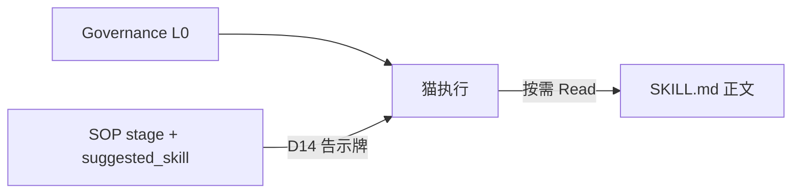

# Clowder AI 架构深度分析

> 基于 `references/clowder-ai` 源码与 `references/cat-cafe-tutorials` 教程整理。  
> 分析日期：2026-07-02（v2 全量补全）

## 目录

| 章 | 主题 |
|----|------|
| [1](#1-参考目录总览) | 参考目录总览 |
| [2](#2-monorepo-结构) | Monorepo 结构 |
| [3](#3-agent-调用cli-子进程--mcp-回传) | Agent 调用 |
| [4](#4-路由u2a-与-a2a) | U2A / A2A 路由 |
| [5](#5-a2a-worklist-单路径) | Worklist 单路径 |
| [6](#6-session--thread-五概念模型adr-020) | Session / Thread |
| [7](#7-mcp-回调桥) | MCP 回调桥 |
| [8](#8-记忆与知识系统) | 记忆系统 |
| [9](#9-skillssopgovernance-三层分工) | Skills / SOP / Governance |
| [10](#10-mission-hub作战中枢) | Mission Hub |
| [11](#11-前端架构要点) | 前端架构 |
| [12](#12-设计模式与扩展点) | 设计模式 |
| [13](#13-教程与源码对照) | 教程对照 |
| [14](#14-关键设计决策摘要) | 设计决策摘要 |
| [15](#15-transport-plane--im-连接器) | IM 连接器 |
| [16](#16-dispatch--queue-排队续跑) | 排队续跑 |
| [17](#17-认证与授权双系统) | 认证授权 |
| [18](#18-ball-custody-球权引擎) | 球权引擎 |
| [19](#19-统一调度-schedule) | 统一调度 |
| [20](#20-mcp-工具全景与-env-策略) | MCP 工具全景 |
| [21](#21-desktop-桌面应用) | Desktop |
| [22](#22-approval-hub-审批中心) | 审批中心 |
| [23](#23-插件双体系) | 插件双体系 |
| [24](#24-协同全景与-teamact) | 协同全景 |
| [25](#25-guides--bootcamp-场景引导) | Guides / Bootcamp |
| [26](#26-concierge-前台猫猫猫球) | Concierge |
| [27](#27-signals-信号研究) | Signals |
| [28](#28-world-engine-平行世界) | World Engine |
| [29](#29-limb-远程四肢) | Limb |
| [30](#30-terminal--tmux-集成) | Terminal |
| [31](#31-preview-gateway-嵌入式预览) | Preview |
| [32](#32-community-ops-社区运维) | Community Ops |
| [33](#33-pack-系统多-agent-mod) | Pack 系统 |
| [34](#34-projects-领域深化) | Projects 深化 |
| [35](#35-governance-bootstrap--agent-hooks) | Governance Bootstrap |
| [36](#36-external-runtime-sessions) | External Runtime |
| [37](#37-services-辅助服务生命周期) | Services |
| [38](#38-workspace-工作区) | Workspace |
| [39](#39-harness-eval-评估飞轮) | Harness Eval |
| [40](#40-agent-key--cloud-bridge) | Agent Key |
| [41](#41-action-plane-外部动作) | Action Plane |
| [42](#42-code-intelligence-约定图) | Code Intelligence |
| [43](#43-体验与辅助层) | 体验层 |
| [44](#44-数据存储全景) | 数据存储 |
| [45](#45-adr-与架构资产索引) | ADR 索引 |
| [附录](#附录术语表) | 术语表 |

---

## 1. 参考目录总览

工作区 `references/` 包含两个关联项目：

| 目录 | 性质 | 说明 |
|------|------|------|
| **clowder-ai** | 完整源码 | pnpm monorepo，生产级多 Agent 协作平台 |
| **cat-cafe-tutorials** | 教程文档 | 16 课复盘 + 研究笔记，无应用源码 |

关系：教程记录真实演进与踩坑；源码是开源实现。教程讲「为什么」，源码是「怎么做」。

### 1.1 项目定位

Clowder AI（内部 npm 名 `cat-cafe`）要解决的核心问题：**人类不再当「人肉路由器」**——让 Claude / Codex / Gemini 等 Agent 在持久身份、共享记忆、协作纪律下真正组队，而不是在聊天窗口间复制粘贴。

三层原则：

| 层级 | 负责 | 不负责 |
|------|------|--------|
| **模型层** | 理解、推理、生成 | 长期记忆、执行纪律 |
| **Agent CLI 层** | 工具、文件、命令 | 团队协作、跨角色 review |
| **平台层（Clowder）** | 身份、路由、SOP、审计 | 推理本身 |

> 模型给能力上限，平台给行为下限。

---

## 2. Monorepo 结构

**技术栈**：Node ≥ 24、pnpm 9、TypeScript 5.3、Fastify、Next.js 14、Redis、SQLite、Biome、Vitest。

```
clowder-ai/
├── packages/
│   ├── api/                # 主后端 @cat-cafe/api（21 个 domain）
│   ├── web/                # 前端 @cat-cafe/web
│   ├── shared/             # 共享类型 @cat-cafe/shared
│   ├── mcp-server/         # MCP stdio 服务（80+ 工具）
│   ├── finance/            # 金融事实查询库
│   └── convention-graph/   # 代码约定图引擎（F242）
├── cat-cafe-skills/        # Skills 内容（SKILL.md）
├── sop-definitions/        # SOP 机器真相源（YAML）
├── guides/                 # 场景引导流程（YAML registry）
├── plugins/                # 平台插件（如 github）
├── scripts/                # 启动、门禁、运维
├── docs/                   # ADR、Feature、Architecture cells
└── desktop/                # Electron 桌面壳
```

### 2.1 各包职责

| 包 | 职责 |
|---|---|
| **api** | Fastify + Socket.IO；200+ 路由、21 领域包、CLI 调用、连接器、记忆索引 |
| **web** | Next.js 控制台：聊天、Hub、Mission Hub、Memory、Settings |
| **shared** | 跨包类型、Zod Schema、CatRegistry、Redis 工具 |
| **mcp-server** | 暴露 `cat_cafe_*` MCP 工具，桥接 CLI ↔ API callback |
| **finance** | 金融事实查询，供 MCP 使用 |
| **convention-graph** | worktree 本地约定发现（MCP/skill/route 提取） |

依赖方向：`web` / `api` / `mcp-server` → `shared`；`mcp-server` 通过 HTTP callback 回连 `api`。

### 2.2 API 启动序列（简化）

```
Telemetry → Fastify + Auth → SocketManager → Redis（可选）
  → Store Factories（Thread / Message / SessionChain / ...）
  → AgentRegistry + AgentRouter
  → InvocationQueue + QueueProcessor
  → Memory Services（SQLite evidence + event-memory + world）
  → TaskRunnerV2（Schedule）
  → ConnectorRouter（IM 网关）
  → 200+ routes → listen
```

**Store 工厂模式**：`ports/*.ts` 定义接口，`redis/` 实现；无 Redis 时降级内存。

### 2.3 API 领域包一览（21 个）

| Domain | 职责 |
|--------|------|
| `cats` | Agent 调用、路由、Session、Provider |
| `memory` | Evidence 索引、检索、Perspectives |
| `ball-custody` | 球权事件流 + 投影 |
| `community` | GitHub issue/PR 事件溯源 |
| `concierge` | 前台猫（猫猫球） |
| `guides` | 场景引导引擎 |
| `limb` | 远程四肢节点 |
| `packs` | Pack 安装/管理 |
| `plugin` | 平台插件框架 |
| `preview` | 嵌入式浏览器代理 |
| `projects` | Intent Card、风险检测、Digest |
| `feat-trajectory` | Feature 轨迹投影 |
| `signals` | 外部资讯 inbox |
| `story` | 叙事渲染 |
| `terminal` | Tmux 终端 |
| `workspace` | worktree 文件操作 |
| `world` | 平行世界叙事引擎 |
| `approval-hub` | 审批聚合 |
| `services` | sidecar 生命周期 |
| `health` | 健康检查 |
| `leaderboard` | 积分排行 |

---

## 3. Agent 调用：CLI 子进程 + MCP 回传

**ADR-001** 决策：默认路径为 **CLI 子进程 + MCP 回传**，非 SDK 直连。

| 原因 | 说明 |
|------|------|
| 订阅额度 | SDK 只能用 API key；CLI 可用 Max/Plus/Pro 订阅 |
| 完整能力 | CLI 保留文件、命令、MCP 工具 |
| 程序化集成 | MCP callback 弥补缺口 |

各猫 CLI 映射：

| 猫 | CLI |
|---|---|
| 布偶猫 (Claude) | `claude --output-format stream-json` |
| 缅因猫 (Codex) | `codex exec --json` |
| 暹罗猫 (Gemini) | `gemini --acp` 或 `agy --print`（Antigravity） |

### 3.1 端到端调用流

```
POST /api/messages
  → 写 MessageStore，创建 InvocationRecord + callbackToken
  → 202 立即返回（写入与执行解耦，ADR-008）
  → 后台 AgentRouter.routeExecution()
      → invokeSingleCat()
          → SessionManager 取 CLI sessionId
          → SystemPromptBuilder 组装 prompt
          → AgentService.invoke() → spawnCli()
          → 注入 MCP 环境变量（invocationId, callbackToken）
          → 解析 NDJSON 流 → yield AgentMessage
  → MessageStore 存回复 + Socket.IO 推送
  → QueueProcessor 处理后续队列
```

关键模块：

| 模块 | 路径 |
|------|------|
| CLI Spawn | `packages/api/src/utils/cli-spawn.ts` |
| 单猫调用 | `packages/api/src/domains/cats/services/agents/invocation/invoke-single-cat.ts` |
| 路由核心 | `packages/api/src/domains/cats/services/agents/routing/AgentRouter.ts` |
| Invocation 鉴权 | `packages/api/src/domains/cats/services/agents/invocation/InvocationRegistry.ts` |

### 3.2 多 Provider 变体

| Provider | 说明 |
|----------|------|
| **CLI 默认** | ADR-001 主路径 |
| **Native（F159）** | opt-in API 直连 |
| **ACP** | Gemini `--acp` 协议 |
| **Antigravity** | `agy` + Bridge；`CAT_CAFE_READONLY=true` 持久 MCP |
| **Agent Key（F178）** | 无 invocation token 时通过 agent-key 解锁写工具 |
| **Cloud Bridge（F238）** | 云端猫（如砚砚）通过 cloud-pro-phase0 白名单 |

F159 允许 opt-in native provider，但 CLI 仍是默认主路径。

---

## 4. 路由：U2A 与 A2A

### 4.1 用户侧 @mention（U2A）

`AgentRouter` 职责：

- **有 @** → 路由到指定猫，更新 thread participants
- **无 @** → fallback 到最近回复猫（F078），或分页回看最近 5 条 user message 的 mentions（F194）
- **Intent 分流**：`ideate` + 多猫 → `routeParallel`；`execute` 或单猫 → `routeSerial`

### 4.2 猫侧 A2A（Agent-to-Agent）

猫回复中的行首 `@mention` 触发 A2A，经 **F27 统一 worklist 单路径** 处理（见第 5 节）。

防护机制：

- `MAX_A2A_DEPTH`（默认 15）
- `MAX_A2A_MENTION_TARGETS = 2`
- Ping-Pong 检测：A↔B 来回 ≥2 警告，≥4 阻断

---

## 5. A2A Worklist 单路径

### 5.1 「单路径」指什么

**F27 之前**：猫通过 MCP `cat_cafe_post_message` 回传并 `@` 另一只猫时，系统会**再开一条独立的 `routeExecution`**，导致双路径触发、子 invocation 不受父级约束、无限递归。

**F27 之后**：`@mention` 只往**父 invocation 的 worklist** 追加目标，由同一个 `routeSerial` 的 `while` 循环继续执行。

```
用户消息 → routeSerial 启动
  → registerWorklist(list=[A, B, ...])
  → while (index < worklist.length)     ← 只有这一条执行循环
      → 猫 A 完成 / MCP 回传 @C
      → pushToWorklist(C)               ← 不新开 routeExecution
      → 继续执行 C
```

### 5.2 Worklist 作用域：per-invocation，非 per-thread

| 维度 | 关系 |
|------|------|
| **主键** | `parentInvocationId`（F108）；未传则退化为 `threadId`（兼容） |
| **一个 invocation** | 恰好 **1 个** worklist |
| **一个 thread** | 可有 **0～N 个** worklist（并发 invocation） |
| **生命周期** | `routeSerial` 开始时 `registerWorklist`，结束时 `unregisterWorklist` |

### 5.3 两条 A2A 注入通道，汇入同一 worklist

| 入口 | 时机 | 机制 |
|------|------|------|
| **内联** | 某只猫执行完，检查回复里的 `@mention` | `route-serial` 直接追加 |
| **Callback** | 猫执行中用 MCP `post_message` 发 `@mention` | `pushToWorklist(..., parentInvocationId)` |

Callback 有 caller 校验：只有**当前正在执行的那只猫**才能 push，防止 stale callback 污染新 invocation。

### 5.4 WorklistEntry 核心字段

- `list: CatId[]` — 可增长的猫 ID 队列
- `executedIndex` — 当前执行位置
- `a2aCount` / `maxDepth` — 深度限制
- `a2aFrom` / `a2aTriggerMessageId` — 谁 @ 了谁、触发消息 ID
- `streakPair` — ping-pong 检测

---

## 6. Session / Thread 五概念模型（ADR-020）

```
Connector Binding → Thread → Session Chain (per cat)
                          → Active Slot
                          → CLI Resume mapping
```

| 概念 | 说明 |
|------|------|
| **Thread** | 共享聊天室：title、participants、routing policy |
| **Message** | 消息归属 thread |
| **Session Chain** | 每猫每 thread 的 session 序列（seq 0→1→2…） |
| **Active Slot** | 每猫每 thread 最多 1 个 active session |
| **CLI Session** | `userId:catId:threadId` → CLI sessionId |

**关键隔离**：Session 按 `threadId` 隔离（修复跨 thread 污染 bug）。

### 6.1 扩展机制

| 机制 | 说明 |
|------|------|
| **Delivery Cursor** | Redis 原子游标：`delivery-cursor`、`mention-ack` |
| **Seen Cursor（F254）** | 独立命名空间，供 freshness gate 使用 |
| **Session Sealer** | 封存旧 session，触发 handoff proposal（F225） |
| **Continuation Token** | invocation 完成后续跑上下文（F047） |
| **External Runtime Session（F211）** | 跨 CLI runtime 的 session 元数据注册与读取 |

---

## 7. MCP 回调桥

```
API 创建 invocation → 签发 { invocationId, callbackToken }
  → 环境变量注入 CLI 子进程
  → CLI 加载 mcp-server（stdio）
  → 猫调用 cat_cafe_post_message 等写工具
  → mcp-server → POST /api/callbacks/*
  → 验证 token → 写 MessageStore → 触发 A2A → Socket.IO 推送
```

安全：每次 invocation 独立 token（TTL 2h）。工具可见性由 ENV 策略控制（见第 20 节）。

---

## 8. 记忆与知识系统

> 完整上游文档：`references/clowder-ai/docs/architecture/memory-system-overview.md`

### 8.1 分层全景

```
Truth Sources（docs、thread、profile、taste、events）
  → Materialization + Index（Scanner → evidence.sqlite）
  → Recall + Drill-down（search / graph / list_recent / Perspective）
  → Governance + Eval（authority、health、consumption、harness）
  → Specialized Lanes（taste F221、profile F231、event memory F227）
  → Consumers（prompt 注入、anchor-first、猫猫球）
```

一句话：**truth sources + compiled indices + recall tools + governance/eval + profile/taste lanes**。

### 8.2 Evidence 索引（F102 底座）

```
docs/*.md（真相源）→ Scanner → IndexBuilder → evidence.sqlite
  ├── evidence_fts (FTS5 BM25)
  ├── evidence_vectors (vec0, dim=768)
  ├── edges（知识图谱）
  └── summary_segments（LSM 摘要）
```

检索模式：lexical（BM25）、semantic（vec0）、hybrid（RRF 融合）。

| 工具 | 适用场景 |
|------|----------|
| `search_evidence` | 语义/模糊入口，mode=hybrid 默认 |
| `graph_resolve` | 精确 anchor（F186、ADR-019）+ 关系 |
| `list_recent` | 零先验时间窗口扫描 |

### 8.3 专用记忆车道

| 车道 | Feature | 作用 |
|------|---------|------|
| **Event Memory** | F227 | 认知转折事件索引；`teleport` / `backfill_events` / `list_events` |
| **Distillation** | F100/F152 | 项目经验提名 → 脱敏 → 全局回流；`mark_generalizable` / `review_distillation` |
| **Perspectives** | F209 | 保存查询计划，每次现场重跑；活查询藤 |
| **Taste Lane** | F221 | 用户偏好与相处轨迹 |
| **Profile Lane** | F231 | user capsule / relationship primer |
| **Collections** | F186 | project/global/library/collection 联邦 |

### 8.4 治理与评估

- **F163**：authority / activation / status / salience
- **F188**：health dashboard、graph fidelity、collection lifecycle
- **F200**：consumption telemetry（记录猫是否真的读了候选，不提升 authority）
- **F192**：harness eval verdict loop（见第 39 节）

### 8.5 数据存储

| 存储 | 用途 |
|------|------|
| **Redis** | Thread、Message、Session、Invocation Auth、WorkflowSop、BallCustody 投影等 |
| **evidence.sqlite** | 文档/图谱/向量索引 |
| **event-memory.sqlite** | 认知转折事件 |
| **world.sqlite** | 平行世界状态 |

Redis 可选，无则全内存降级。WorkflowSop 存于 `workflow:sop:{backlogItemId}`。

---

## 9. Skills、SOP、Governance 三层分工

不是重复系统，而是回答不同问题：

| 层 | 回答什么 | 类比 | 真相源 |
|---|---|---|---|
| **Governance** | 永远不能违反的底线？ | 公司铁律 | `governance-pack.ts` → CLAUDE.md/AGENTS.md |
| **SOP** | Feature 现在在哪个阶段？ | 项目看板 | `sop-definitions/development.yaml` |
| **Skills** | 这个阶段具体怎么做？ | 操作手册 | `cat-cafe-skills/*/SKILL.md` |

### 9.1 衔接关系



### 9.2 SOP 阶段流水线（development）

```
kickoff → impl → quality_gate → [fresh_context] → review → merge → completion
```

### 9.3 Governance Bootstrap（F070）

Governance 不止铁律文本，还有**外派机制**：

- `governance-bootstrap.ts` 向外部项目写入 managed blocks
- `skill-sync-engine.ts` 同步 skills symlink
- `agent-hooks/` + `routes/agent-hooks.ts` 检测 Claude/Codex hook 漂移并一键修复

详见第 35 节。

---

## 10. Mission Hub（作战中枢）

### 10.1 是什么

**Mission Hub** 是 Feature 治理面板，路由 `/mission-hub`（组件 `MissionControlPage`）。

核心模块：

| 模块 | 作用 |
|------|------|
| **Backlog** | Feature 任务：`open → suggested → approved → dispatched → done` |
| **SOP 告示牌** | 每 backlog 项的 `WorkflowSop` |
| **Thread 态势** | 聊天线程与 backlog 关联 |
| **需求审计** | Intent Card 拆桶、风险检测（见第 34 节） |

### 10.2 WorkflowSop 与告示牌哲学

**告示牌哲学**（F073）：存信息，不控制流程。猫看了自己决定行动。系统不自动跳转 stage。

推进：`cat_cafe_update_workflow` → Redis CAS → prompt D14 注入。

### 10.3 与 Ball Custody 的区别

| 维度 | WorkflowSop.batonHolder | Ball Custody |
|------|-------------------------|--------------|
| 性质 | 告示牌隐喻，猫自报 | 事件溯源引擎，系统观测 |
| 存储 | Redis `workflow:sop:*` | append-only Event Log + 投影 |
| 用途 | Feature 阶段协作 | 责任单元行动权 + freshness |

---

## 11. 前端架构要点

**技术栈**：Next.js 14、React 18、Tailwind、Zustand、Socket.IO。

### 11.1 Bubble Pipeline（F183）

```
Socket.IO agent_message → chatStore → bubble-reducer → UI 投影
```

ownership cell：`docs/architecture/ownership/cells/bubble-pipeline.md`

### 11.2 路由地图

| 路由 | 用途 |
|------|------|
| `(chat)/` | 主聊天界面 |
| `(chat)/thread/[threadId]` | 指定线程 |
| `memory/` | 记忆面板（search/graph/catalog/health/status） |
| `mission-hub/`、`mission-control/` | Mission Hub |
| `signals/` | 信号 inbox + Study Mode |
| `settings/` | 10+ 配置分区 |
| `story/[storyId]` | Feature 轨迹叙事 |
| `pixel-brawl/` | 像素猫对战（体验层） |

### 11.3 Settings 分区（F190）

| Section | 内容 |
|---------|------|
| members | 成员名册、编排顺序 |
| accounts | 模型账户、凭据 |
| im | 飞书、钉钉、企微等连接器 |
| skills | Skill 管理、安装 |
| mcp | MCP 服务、工具目录 |
| plugins | 插件状态、外部集成 |
| marketplace | 能力包搜索安装 |
| voice | 语音 I/O、TTS |
| system | 环境、运行时开关 |
| rules | 家规、SOP、提示词 |
| notify | 推送订阅 |
| ops | 服务健康、观测 |

入口层级：L1 Activity Bar（每日核心）→ L2 Settings（管理配置）→ L3 Settings 子 tab → L4 独立路由。

---

## 12. 设计模式与扩展点

| 模式 | 应用 |
|------|------|
| Factory + Port/Adapter | Store 可 Redis/内存切换 |
| Registry | Agent、Invocation、Plugin、Worklist、Limb |
| Event Sourcing + Projection | Ball Custody、Community Ops |
| Async Generator | `invoke()` 流式 yield |
| Composition Root | `index.ts` 集中装配 |
| CQRS Read Model | Approval Hub、Eval Hub |

| 扩展点 | 入口 |
|--------|------|
| 新 AI Provider | 实现 `AgentService` → `AgentRegistry` |
| 新 MCP 工具 | `mcp-server/src/tools/` + `server-toolsets.ts` |
| 新 Skill | `cat-cafe-skills/` + manifest |
| 新 SOP 域 | `sop-definitions/*.yaml` + codegen |
| 新 IM 连接器 | `infrastructure/connectors/adapters/` |
| 新 Pack | `.cat-cafe/packs/<name>/` |
| 新 Architecture Cell | `docs/architecture/ownership/cells/` |

---

## 13. 教程与源码对照

| 教程 | 源码/ADR |
|------|----------|
| 01 SDK→CLI | ADR-001、`cli-spawn.ts` |
| 02 CLI 工程化 | `sanitize-cli-stderr.ts` |
| 03 元规则 | `AGENTS.md`、governance |
| 04 A2A 路由 | `AgentRouter.ts` |
| 05 MCP 回传 | `mcp-server`、`callbacks.ts` |
| 06 生产事故 | Redis 隔离、防腐门 |
| 07 平台化 | Connectors、`ConnectorRouter` |
| 08 Session | ADR-020、SessionManager |
| 09 上下文工程 | SystemPromptBuilder |
| 10 知识管理 | `domains/memory/` |
| 11 语音管线 | TTS、Whisper |
| 12 无 Boss Agent | 分布式路由 |
| 13-15 演进 | Mission Hub、Harness |

---

## 14. 关键设计决策摘要

1. **CLI-first** — 订阅额度 + 完整 agent 能力（ADR-001）
2. **写入与执行解耦** — 202 + background invocation（ADR-008）
3. **Thread 共享 + Session per-cat 隔离** — 防跨 thread 污染（ADR-020）
4. **A2A worklist 单路径（F27）** — 消除 callback 双路径递归
5. **告示牌而非状态机（F073）** — 外化上下文，不外包判断力
6. **Skills/SOP/Governance 三层** — 底线 / 阶段 / 操作分工
7. **事件溯源球权（F233）** — append-only + 可重建投影
8. **Busy gate 分层（ADR-034）** — 用户/A2A/连接器/调度不同规则
9. **MCP 白名单优先（F061）** — 新工具默认 excluded
10. **Pack = Me × Pack + Growth（ADR-021）** — 多 agent 世界可分享

---

## 15. Transport Plane / IM 连接器

> ownership cell：`transport` | Feature：F088、F124 | ADR-014（小艺）

### 15.1 架构

```
外部 IM（飞书/微信/钉钉/Telegram/企微/小艺）
  → Adapter（平台协议解析）
  → ConnectorRouter（平台中立路由、去重、命令层）
  → Principal Link + Session Binding（externalChatId ↔ threadId）
  → POST /api/messages → AgentRouter
  ← OutboundDeliveryHook / StreamingOutboundHook（富文本/卡片/媒体）
```

**连接方向**：多数为 webhook 入站；钉钉 Stream、小艺 OpenClaw 为 Cat Cafe **主动连接**外部服务器。

### 15.2 已接入渠道

| 渠道 | 模式 |
|------|------|
| 飞书 Lark | Webhook + Action Plane |
| 微信 | 公众号/企业接入 |
| 钉钉 | Stream 长连接 |
| Telegram | Bot API |
| 企业微信 | Webhook |
| 小艺（华为） | WebSocket OpenClaw（ADR-014） |

### 15.3 核心概念

| 概念 | 说明 |
|------|------|
| **Principal Link** | `connectorId` + `externalChatId` + `externalSenderId` |
| **Session Binding** | `bindingKey` → `threadId`；支持 `/new` `/threads` `/use` |
| **MessageEnvelope** | 平台中立消息信封 |
| **ConnectorCommandLayer** | `/new`、`/threads` 等平台命令 |

### 15.4 关键路径

- `packages/api/src/infrastructure/connectors/ConnectorRouter.ts`
- `packages/api/src/infrastructure/connectors/ConnectorThreadBindingStore.ts`
- `packages/api/src/infrastructure/connectors/im-connectors/`
- `routes/connector-hub.ts`、`connector-webhooks.ts`

### 15.5 与 Action Plane 的边界

企业微信/飞书的**外部动作**（发卡片、调 API）归 Action Plane（第 41 节），不归 Connector Adapter。

---

## 16. Dispatch / Queue 排队续跑

> ownership cell：`dispatch` | Feature：F175、F185 | ADR-034

### 16.1 机制

猫执行中时，新消息进入 **per-thread per-user FIFO 队列**（深度上限 5）。Invocation 完成后 `QueueProcessor` 自动出队执行。

```
POST /api/messages
  → busy gate 检查（分层，见下）
  → 若 thread 忙 → InvocationQueue.enqueue()
  → invocation 完成 → QueueProcessor.tryAutoExecute()
      → 出队 → routeExecution()
```

### 16.2 Busy Gate 分层（ADR-034）

| 来源 | 策略 |
|------|------|
| 用户广播 | 可排队或侧发 |
| 用户 @mention | 较高优先级 |
| 外部连接器 wake | 经 `ConnectorInvokeTrigger` |
| A2A continuation | 非 urgent（防 agent 饿死用户消息） |
| hold_ball wake | 独立路径 |
| 调度任务 | thread 忙时 defer |

**公平性**：非 agent 条目不得被 agent chain 饿死。

### 16.3 优先级与续跑

- `urgent`：用户/系统阻塞工作，**不用于**普通 A2A
- `continuation token`：协作连续性胶囊（F047）
- `SessionContinuationCoordinator`：跨 invocation 上下文传递

### 16.4 关键路径

- `InvocationQueue.ts`
- `QueueProcessor.ts`（1900+ 行，核心调度逻辑）
- `InvocationTracker.ts`
- `ConnectorInvokeTrigger.ts`

---

## 17. 认证与授权双系统

两套**独立**系统，不可混淆。

### 17.1 Session Auth（人类登录）

- Cookie `cat_cafe_session` → 内存/Redis SessionStore
- 默认懒创建 `default-user`（本地开发）
- 路径：`infrastructure/session-auth.ts`

### 17.2 Callback Auth（猫 invocation 鉴权）

- 每次 invocation 签发 `{ invocationId, callbackToken }`（TTL 2h）
- MCP 写工具携带 token → `POST /api/callbacks/*`
- ownership cell：`callback-auth`
- 路径：`InvocationRegistry.ts`、`callback-auth-prehandler.ts`

### 17.3 Authorization（猫请求人类审批）

猫通过 MCP `cat_cafe_request_permission` 请求敏感操作审批：

```
猫 request_permission → AuthorizationManager
  → 规则匹配 + pending 队列
  → 120s 超时
  → 人类 approve/deny（Web / 桌面通知 / Tab 闪烁）
  → 审计日志
```

路径：`domains/cats/services/auth/AuthorizationManager.ts`、`routes/authorization.ts`

---

## 18. Ball Custody 球权引擎

> ownership cell：`ball-custody` | Feature：F233、F254

### 18.1 与 batonHolder 的区别

WorkflowSop 的 `batonHolder` 是**告示牌隐喻**（猫自报）。Ball Custody 是**系统观测引擎**——回答「谁该对一个责任单元行动」。

### 18.2 事件溯源架构

```
系统动作旁路点 → BallCustodyIngest.record()（fire-and-forget）
  → BallCustodyEventLog（append-only，唯一真相源）
  → BallCustodyProjector.apply()（零外部副作用）
  → BallCustodyProjectionStore（可重建投影）
```

### 18.3 七态状态机

`new` → `active` / `blocked` / `parked` / `dead` / `void` / `zombie` → `resolved`

| 形态 | 含义 |
|------|------|
| active | 当前持球，应行动 |
| blocked | 等待外部输入 |
| parked | 主动搁置 |
| dead | 责任单元已死 |
| void | 虚空传球（无接收者） |
| zombie | 异常滞留 |

subjectKey 从现有痕迹派生：`ball:thread:{id}` / `ball:task:{id}`，**不引入球 ID 新原语**。

### 18.4 F254 Freshness Gate

侧挂独立 `seenCursor` 命名空间 + `FreshnessAttentionEventLog`：

- 判断猫发消息/退球前是否忽略了新消息
- freshness 事件**不并入** BallCustodyEvent
- `hold_ball` 前触发 content-free notice

### 18.5 MCP 接口

- `cat_cafe_hold_ball` — 猫主动持球/释球
- 路由事件：`ball.handed`、`ball.void_pass` 自动 ingest

---

## 19. 统一调度 Schedule

> ADR-022 | Feature：F139

### 19.1 从 setInterval 到 TaskRunnerV2

| 旧模式 | 新模式 |
|--------|--------|
| 硬编码 `setInterval` | TaskSpec 五维模型 |
| 重启丢状态 | RunLedger SQLite 持久 |
| 各自为战 | 统一 `TaskRunnerV2` |

### 19.2 TaskSpec 模型

- **触发**：cron / once / interval
- **执行体**：cheap check gate → 可选 LLM invocation
- **策略**：activeHours、isolatedSession、全局暂停
- **静默协议**：`HEARTBEAT_OK` — 无事则闭嘴

### 19.3 集成点

- Plugin Schedule Factory（GitHub PR 轮询等）
- 记忆摘要调度（F102，原 30min interval）
- Community Reconciler 定时对账
- MCP：`register_scheduled_task` / `remove_scheduled_task`

路径：`infrastructure/scheduler/TaskRunnerV2.ts`、`domains/plugin/ScheduleFactoryRegistry.ts`

---

## 20. MCP 工具全景与 ENV 策略

> ADR-037 | Feature：F043、F061、F178、F247

### 20.1 工具分类（80+）

| 分类 | 代表工具 | 数量 |
|------|----------|------|
| **Collab 协作** | `post_message`, `cross_post_message`, `update_workflow`, `hold_ball`, `create_rich_block`, `request_permission`, `start_vote`, `generate_document`, `multi_mention` | ~35 |
| **Memory 记忆** | `search_evidence`, `graph_resolve`, `list_recent`, `list_session_chain`, `read_session_digest`, `run_perspective`, `library_*` | ~20 |
| **Event Memory** | `teleport`, `backfill_events`, `list_events` | 3 |
| **Schedule** | `register_scheduled_task`, `remove_scheduled_task`, `list_schedule_templates` | 4 |
| **Signals** | `signal_list_inbox`, `signal_get_article`, `signal_search`, `signal_start_study`, `signal_generate_podcast` | ~12 |
| **Limb** | `limb_invoke`, `limb_list_available`, `limb_pair_approve` | 4 |
| **Audio** | `audio_capture_start/stop`, `audio_read_transcript`, `audio_enroll_speakers` | 8 |
| **Hub Actions** | `workspace_navigate`, `preview_open` | 2 |
| **External Runtime** | `register/read/list_external_runtime_sessions` | 3 |
| **Guides** | `start_guide`, `guide_control`, `update_bootcamp_state`, `bootcamp_env_check` | 4 |
| **Distillation** | `mark_generalizable`, `nominate_for_global`, `review_distillation` | 3 |
| **Harness** | `publish_verdict` | 1 |
| **Game** | `submit_game_action` | 1 |
| **Finance** | `finance_query` | 1 |
| **Shell** | `shell_exec` | 1 |

### 20.2 ENV 策略矩阵（优先级从高到低）

```
1. CAT_CAFE_DESKTOP_MODE
   fable-phase0 / cloud-pro-phase0 → 严格 10 工具白名单
   未知值 → 启动 fail-fast

2. CAT_CAFE_READONLY=true
   → READONLY_ALLOWED_TOOLS ∪ (hasAgentKey ? AGENT_KEY_TOOLS : ∅)

3. 默认
   → 全量注册
```

**Desktop 10 工具白名单**（5 collab + 5 memory）：

- collab：`post_message`, `cross_post_message`, `get_thread_context`, `list_threads`, `get_message`
- memory：`search_evidence`, `graph_resolve`, `list_recent`, `list_session_chain`, `read_session_digest`

**Agent Key 解锁工具**（readonly 模式下额外开放）：`post_message`, `cross_post_message`, `create_rich_block`, `workspace_navigate`, `preview_open`, `teleport`, `backfill_events`, `list_events`, `get_message`, `publish_verdict` 等。

路径：`mcp-server/src/server-toolsets.ts`

---

## 21. Desktop 桌面应用

> Feature：F113、F180、F178

### 21.1 架构

Electron 壳启动后端子进程栈：

```
desktop/main.js
  → ServiceManager
      → Redis
      → API（@cat-cafe/api）
      → Web（Next.js）
  → BrowserWindow 加载 Web UI
  → Tray + Splash
```

### 21.2 关键特性

- **macOS DMG 安装守卫**：禁止从 `/Volumes/` 直接运行，必须拖入 Applications
- **用户数据目录**：与开发模式隔离
- **F178 联动**：Desktop 模式注入 `CAT_CAFE_DESKTOP_MODE=fable-phase0`，MCP 严格 10 工具

路径：`desktop/main.js`、`desktop/service-manager.js`、`desktop/installer/`

---

## 22. Approval Hub 审批中心

> Feature：F246 | ownership cell：`approval-index`

### 22.1 CQRS 聚合模式

Hub **不维护独立审批 index**，而是实时从各 canonical store 拉 pending：

| 来源 Feature | 审批类型 |
|-------------|----------|
| F128 | 权限请求 |
| F225 | Session handoff |
| F193 | Thread 创建提案 |
| F231 | Profile 更新提案 |

### 22.2 数据流

```
各 Feature Store（canonical）
  → approval-hub/adapters/*（per-feature 查询）
  → GET /api/approval-hub（聚合读模型）
  → ApprovalHubDrawer（Web UI，badge + inline approve）
```

路径：`domains/approval-hub/`、`packages/web/src/components/ApprovalHubDrawer.tsx`

---

## 23. 插件双体系

### 23.1 Platform Plugin（F202）

仓库内声明式插件，扩展平台能力：

```
plugins/github/plugin.yaml
  → PluginRegistry 加载
  → ScheduleFactoryRegistry 注册定时任务
  → PluginResourceActivator 激活资源
```

路径：`domains/plugin/`、`plugins/github/`

### 23.2 IM Connector Plugin（F240）

统一 `IMConnectorPlugin` 接口，支持外部 tar 安装：

- 内置：feishu、weixin、dingtalk、telegram、wecom
- 外部：`.cat-cafe/plugins/` 目录

路径：`infrastructure/connectors/plugins/`、`routes/connector-plugins.ts`

### 23.3 与 Pack 的区别

| | Plugin | Pack（ADR-021） |
|---|--------|-----------------|
| 粒度 | 单一能力扩展 | 完整多 agent 世界定义 |
| 内容 | manifest + schedule | masks、guardrails、workflows、knowledge、world-driver |
| 公式 | 平台能力 | Experience = Me × Pack + Growth |

---

## 24. 协同全景与 TeamAct

> 上游文档：`docs/architecture/collaboration-landscape.md`

### 24.1 三圈模型

| 圈 | 关系 |
|----|------|
| **圈一·猫↔猫** | A2A 路由、worklist、球权、TeamAct 主循环 |
| **圈二·人↔猫** | 猫猫球、bootcamp、profile/taste 记忆车道 |
| **圈三·三角交叉** | 注意力预算、mission hub、审批 |

### 24.2 TeamAct 主循环

```
State → Owner → Action → Evidence → Verdict → Route
```

贯穿三圈的主协作循环，不靠单一 Boss Agent。

### 24.3 Harness 新陈代谢（元轴）

```
F245 摩擦采集 → F100 自进化 → F114/F177 规则硬化
  → F192 eval → F234 sunset 消融 → F070 治理产物化
```

协同系统自我进化、退役过时规则。

---

## 25. Guides / Bootcamp 场景引导

> Feature：F087、F106、F110、F155

### 25.1 Guides 引擎

YAML 驱动的场景引导：

```
guides/registry.yaml（流程注册表）
  → GuideSession（per-thread 状态机）
  → MCP：get_available_guides → start_guide → guide_control
  → prompt 注入 D17
```

状态流转：`offered → awaiting_choice → active → completed/cancelled`

### 25.2 Bootcamp

多阶段 onboarding 引导新用户：

- `update_bootcamp_state` / `bootcamp_env_check` MCP 工具
- prompt 模板：`assets/prompt-templates/d16-bootcamp.md`
- 路由：`routes/bootcamp.ts`

路径：`guides/`、`domains/guides/`、`guides/flows/*.yaml`

---

## 26. Concierge 前台猫（猫猫球）

> Feature：F229 | ownership cell：`concierge-surface`

### 26.1 架构原则

前台猫是**岗位（duty post）**，不是新 agent 类：

1. **对话载体** — per-user `threadKind='concierge'` 隐藏线程
2. **值班猫** — 普通猫 invocation + `ConciergePromptSection` 注入
3. **零平行基础设施** — 复用 message/invocation/memory 全链路

### 26.2 岗位协议（anchor-first）

- 回复必须带 1–3 个可点击 anchor（feature doc / guide / thread+message）
- 工具白名单：search、graph、list_recent、get_thread_context、feat_index、guides
- 跳转/relay 通过 CardBlock action（`concierge_teleport` / `concierge_peek` / `concierge_relay`）
- 升级：发送 handoff card + 用户原话

### 26.3 存储

- `concierge:config:{userId}` — ConciergeConfig
- `concierge:thread:{userId}` — threadId 映射

路径：`domains/concierge/`

---

## 27. Signals 信号研究

> Feature：F021、F091

### 27.1 作用

外部文章/资讯 inbox，支持 Study Mode、thread 关联、播客生成。路由时注入 `activeSignals`（先搜后聊）。

### 27.2 数据流

```
外部源采集 → Signal Inbox
  → signal_list_inbox / signal_get_article（MCP 只读）
  → signal_start_study → 创建 study thread
  → signal_generate_podcast → TTS 播客
```

### 27.3 前端

- `packages/web/src/app/signals/`
- `packages/web/src/app/signals/sources/`

路径：`domains/signals/`、`mcp-server/src/tools/signals-tools.ts`

---

## 28. World Engine 平行世界

> Feature：F093 | ADR-021（world-driver）

### 28.1 作用

SQLite 存储 world/scene/character 状态，支持叙事驱动的多 agent 协作世界。

### 28.2 运行模式

| Mode | 说明 |
|------|------|
| build | 世界构建 |
| perform | 实时演绎 |
| replay | 回放 |

### 28.3 核心组件

- `WorldRuntimeCoordinator` — 按 mode 执行 action envelope
- `SqliteWorldStore` — world.sqlite 持久
- `WorldContextProvider` — prompt D18 注入
- `CareLoopEvaluator` — 世界关怀循环
- `WorldDriverBridge` — Pack world-driver resolver 桥接

路径：`domains/world/`

---

## 29. Limb 远程四肢

> Feature：F126

### 29.1 作用

远程设备节点注册/租约/策略/审计。猫通过 MCP `limb_invoke` 在远程设备执行动作。

### 29.2 执行管线

```
limb_invoke → policy check → lease acquire → action log → execute → audit
```

Antigravity readonly 模式仍暴露 limb 工具（远程只读观测）。

路径：`domains/limb/`、`mcp-server/src/tools/limb-tools.ts`

---

## 30. Terminal / Tmux 集成

> Feature：F089

### 30.1 作用

Hub 内嵌终端：每 worktree 一个 tmux server。

```
TmuxGateway → 管理 pane 生命周期
AgentPaneRegistry → 绑定猫 session 到 terminal pane
```

路径：`domains/terminal/`、`routes/terminal.ts`

---

## 31. Preview Gateway 嵌入式预览

> Feature：F120 | ownership cell：`hub-action-surface`

### 31.1 作用

独立端口反向代理，让 iframe 安全预览本地 dev server：

- loopback + 端口白名单
- 剥离 X-Frame-Options
- WebSocket HMR 代理

### 31.2 MCP 接口

- `cat_cafe_preview_open` — 猫打开预览
- `cat_cafe_workspace_navigate` — 猫导航工作区文件

路径：`domains/preview/preview-gateway.ts`

---

## 32. Community Ops 社区运维

> Feature：F168、F121 | ownership cell：`community-ops`

### 32.1 事件溯源模式（同 Ball Custody）

```
GitHub webhook / 手动事件
  → CommunityEventLog（append-only）
  → community-projector → CommunityObject 投影
  → 状态机（open/awaiting_external/closed/...）
  → Reconciler 定时对账
```

### 32.2 能力

- Issue/PR 自动跟踪（`register_issue_tracking` / `register_pr_tracking`）
- `community_await_external` — 等待外部响应
- Decision Queue 面板
- Closure Checklist

路径：`domains/community/`

---

## 33. Pack 系统（多 Agent Mod）

> ADR-021 | Feature：F129

### 33.1 产品公式

```
Experience = Me（本地私有） × Pack（可分享） + Growth（私有生长）
```

| 层 | 可共享 | 控制方 |
|----|--------|--------|
| Core Rails | 不可覆盖 | 平台宪法 |
| Pack | 可分享 | 文化种子（masks、guardrails、workflows、knowledge、world-driver） |
| Growth | 不可外发 | 关系果实，经蒸馏回流方法论 |

### 33.2 四层架构

```
Core Rails（平台宪法）
  → Pack（多 agent 世界定义 + World Driver）
  → Growth（私有关系/记忆）
  → 蒸馏回流（仅方法论/模板）
```

### 33.3 安装与管理

- 路径：`.cat-cafe/packs/<name>/`
- API：`routes/packs.ts`（install/list/remove）
- 组件：`PackStore`、`PackCompiler`、`PackSecurityGuard`

---

## 34. Projects 领域深化

> 超越 Mission Hub Backlog 的任务治理

### 34.1 Intent Card 需求审计

PRD 拆分为意图卡分桶，供猫协作审计：

- `intent-card-store.ts`
- `need-audit-frame-store.ts`
- `routes/intent-card-routes.ts`

### 34.2 风险与执行

| 模块 | 作用 |
|------|------|
| `risk-detection-service.ts` | 需求风险自动检测 |
| `execution-digest-store.ts` | 执行摘要沉淀 |
| `reflux-pattern-store.ts` | 回流模式识别 |
| `resolution-store.ts` | 决议记录 |
| `external-project-store.ts` | 外部项目绑定 |

### 34.3 Feat Trajectory + Story

Feature 轨迹投影供 Story Player 可视化叙事：

- `domains/feat-trajectory/`
- `domains/story/`
- 前端：`packages/web/src/app/story/[storyId]/`

---

## 35. Governance Bootstrap & Agent Hooks

> Feature：F070、F180 | ADR-019

### 35.1 Bootstrap 外派

向外部项目（worktree）写入：

- managed blocks（CLAUDE.md / AGENTS.md 片段）
- skills symlink
- hooks 目录

路径：`config/governance/governance-bootstrap.ts`、`skills/skill-sync-engine.ts`

### 35.2 Agent Hooks 健康检查

检测 Claude/Codex hook 配置漂移：

```
GET /api/agent-hooks/status
  → 对比 expected vs actual
  → POST /api/agent-hooks/sync（一键修复）
```

路径：`agent-hooks/`、`routes/agent-hooks.ts`

---

## 36. External Runtime Sessions

> Feature：F211、F050 | ownership cell：`identity-session`

### 36.1 作用

跨 CLI runtime 的 session 元数据透明：

- 注册外部 runtime session
- 读取 session digest / events
- `RuntimeSessionSealReaper` 定期 drain + seal

### 36.2 MCP 工具

- `register_external_runtime_session`
- `read_external_runtime_session`
- `list_external_runtime_sessions`

### 36.3 Antigravity 集成

`AntigravityBridge` + `antigravity-runtime-session-import` 自动导入 ACP session。

路径：`domains/cats/services/runtime-session/`

---

## 37. Services 辅助服务生命周期

> Feature：F066、F111

### 37.1 管理的 Sidecar

| 服务 | 用途 |
|------|------|
| Whisper STT | 语音转文字 |
| MLX TTS | 文字转语音 |
| Embedding | 向量嵌入 |

### 37.2 生命周期

```
install → start → stop → uninstall
  → Services 面板（Settings ops）
  → 审计日志（services-lifecycle-audit）
```

路径：`domains/services/service-lifecycle.ts`、`scripts/services/`

---

## 38. Workspace 工作区

> Feature：F063、F131 | ownership cell：`hub-action-surface`

### 38.1 能力

- 多 worktree 文件浏览/编辑
- HMAC token 鉴权 + sha256 冲突检测
- Git 操作（status/diff/commit）
- 文件 watcher 触发 evidence reindex

### 38.2 安全

`workspace-security.ts` 限制路径逃逸；编辑需 callback 认证。

路径：`domains/workspace/`、`routes/workspace*.ts`

---

## 39. Harness Eval 评估飞轮

> Feature：F192、F177、F200、F245 | ownership cell：`harness-eval`

### 39.1 闭环

```
摩擦信号采集（paw-feel、cancel、user-feedback）
  → friction-aggregator → friction-clusterer
  → eval-hub 面板
  → 猫 publish_verdict
  → verdict-handoff → 规则硬化 / sunset 消融
```

### 39.2 关键组件

- `eval-domain-registry.ts` — 评估域注册
- `verdict-handoff.ts` — 裁决交接
- `reeval-closure.ts` — 重评估闭环
- MCP：`cat_cafe_publish_verdict`

### 39.3 与 SOP 的衔接

SOP `quality_gate` stage 的 `checks.qualityGatePassed` 可与 harness eval 联动（attested vs verified）。

---

## 40. Agent Key & Cloud Bridge

> Feature：F178、F238、F247

### 40.1 Agent Key

持久 MCP 客户端（如 Bengal 猫）无 invocation callback token 时：

- 通过 `CAT_CAFE_AGENT_KEY_SECRET` / `CAT_CAFE_AGENT_KEY_FILE` 认证
- readonly 模式下解锁 `AGENT_KEY_TOOLS` 白名单

### 40.2 Cloud Bridge

云端猫（砚砚 gpt-pro）通过 `cloud-pro-phase0` 模式：

- 复用 Desktop 10 工具白名单
- PinchTab / Cloud Invoke Bridge 云端调用

路径：`domains/cats/services/agents/agent-key/`、`domains/cats/services/cloud-bridge/`

---

## 41. Action Plane 外部动作

> Feature：F162 | ADR-029 | ownership cell：`action-plane`

### 41.1 作用

企业 IM 外部动作的 typed service：

| 平台 | 组件 |
|------|------|
| 企业微信 | `WeComActionService` + `WeComCliExecutor` |
| 飞书 | `LarkActionService` + `LarkCliExecutor` |

### 41.2 与 Connector 的边界

- **Connector**：消息收发、thread binding
- **Action Plane**：卡片发送、API 调用、CLI 执行外部动作

路径：`packages/api/src/infrastructure/enterprise/`、`routes/callback-*-action-routes.ts`

---

## 42. Code Intelligence 约定图

> Feature：F242 | ownership cell：`code-intelligence`

### 42.1 作用

worktree 本地代码约定图引擎：

- 提取 MCP tool、skill manifest、FastAPI route 等约定
- 插件化 domain extractor
- provenance/freshness 元数据

### 42.2 路径

- `packages/convention-graph/`
- `cat-cafe-skills/convention-graph-discovery/SKILL.md`

---

## 43. 体验与辅助层

| 子系统 | Feature | 说明 |
|--------|---------|------|
| **Game / Leaderboard** | F075、F090、F101 | 像素猫对战、成就、积分 |
| **TTS / Voice** | F034、F111、F112 | 流式 TTS、Voice Block、语音输入 |
| **Audio MCP** | F066、F020 | 会议录音、说话人登记、转写 |
| **Finance MCP** | F207 | `finance_query` 金融事实 |
| **Story Export** | F252 | Feature 轨迹可视化叙事 |
| **Telemetry** | F045、F153 | OpenTelemetry、NDJSON 可观测 |
| **Capability Dashboard** | F041、F223 | capabilities.json、mount rules |
| **Push Notification** | F028 | Web Push 授权请求推送 |
| **Thread Navigation** | F057、F095、F187 | labels、pins、favorites |
| **Marketplace** | — | MCP/Skill/插件搜索安装 |

---

## 44. 数据存储全景

### 44.1 Redis Keys（运行时）

| Key 模式 | 用途 |
|----------|------|
| `thread:*` | 线程元数据 |
| `message:*` | 消息 |
| `session:*` | Session chain / active slot |
| `invocation:auth:*` | Callback token |
| `workflow:sop:*` | WorkflowSop |
| `ballcustody:events:*` | 球权事件流 |
| `ballcustody:projection:*` | 球权投影 |
| `concierge:config:*` | 前台猫配置 |
| `community:events:*` | 社区事件流 |

### 44.2 SQLite 库

| 库 | 用途 |
|----|------|
| `evidence.sqlite` | 文档/图谱/向量索引 |
| `event-memory.sqlite` | 认知转折事件 |
| `world.sqlite` | 平行世界状态 |
| `run-ledger.sqlite` | Schedule 执行记录 |

### 44.3 Store 工厂模式

所有 Store 通过 `ports/*.ts` 接口 + `redis/` 或 `memory/` 实现，Composition Root 在 `packages/api/src/index.ts` 集中装配。

---

## 45. ADR 与架构资产索引

### 45.1 关键 ADR

| ADR | 主题 |
|-----|------|
| 001 | CLI 子进程 + MCP 回传 |
| 002 | 协作协议 |
| 003 | Project-Thread 架构 |
| 008 | 消息可变性与 Invocation 生命周期 |
| 014 | 小艺 Connector Gateway |
| 015 | Knowledge Object Contract |
| 018 | 统一派发决策 |
| 020 | Session 五概念（引用为 ADR-020，源码 decisions/003-project-thread 等） |
| 021 | Pack System 架构 |
| 022 | 统一调度抽象 |
| 034 | Dispatch Busy Gate 分层 |
| 037 | MCP 工具认知入口点 |

完整列表：`references/clowder-ai/docs/decisions/`（20+ 条）

### 45.2 Architecture 文档

| 文档 | 主题 |
|------|------|
| `collaboration-landscape.md` | 协同全景（上位生理学图） |
| `memory-system-overview.md` | 记忆分层全景 |
| `at-mention-routing-system.md` | @mention 路由管线 |
| `retrieval-pipeline-deep-dive.md` | 检索管线深潜 |
| `cli-integration.md` | CLI 集成 |
| `user-journeys.md` | 用户旅程 |
| `feature-placement.md` | 前端入口决策树 |

### 45.3 Ownership Cells（16 个）

| Cell | 主题 |
|------|------|
| `transport` | IM 连接器 |
| `dispatch` | 排队续跑 |
| `ball-custody` | 球权引擎 |
| `callback-auth` | 回调鉴权 |
| `approval-index` | 审批中心 |
| `concierge-surface` | 前台猫 |
| `memory` | 记忆全景 |
| `identity-session` | 身份/Session |
| `community-ops` | 社区运维 |
| `harness-eval` | 评估飞轮 |
| `hub-action-surface` | Hub 动作面 |
| `plugin` | 插件框架 |
| `bubble-pipeline` | 气泡管线 |
| `action-plane` | 外部动作 |
| `code-intelligence` | 约定图 |
| `thread-navigation` | Thread 导航 |

索引：`references/clowder-ai/docs/architecture/ownership/README.md`

---

## 附录：术语表

| 术语 | 含义 |
|------|------|
| **CVO** | 首席愿景官 — 平台中心的人类角色 |
| **Clowder** | 英语「一群猫」的专属量词 |
| **告示牌** | WorkflowSop 信息共享面板，非流程控制器 |
| **Resume Capsule** | 冷启动 30 秒接上活的结构化摘要 |
| **Baton** | 接力棒 — WorkflowSop 中的 batonHolder（告示牌隐喻） |
| **Ball Custody** | 球权引擎 — 系统观测的责任单元行动权 |
| **Freshness Gate** | F254 侧挂机制 — 猫行动前是否忽略新消息 |
| **attested / verified** | 猫声明 vs 系统验证 |
| **单路径** | A2A 不新开 invocation，只扩展父 worklist |
| **TeamAct** | State→Owner→Action→Evidence→Verdict→Route 协作主循环 |
| **Transport Plane** | IM 连接器消息入出站层 |
| **Action Plane** | 企业 IM 外部动作执行层 |
| **Pack** | 可分享的多 agent 世界定义（ADR-021） |
| **Growth** | 用户与猫私有生长的关系/记忆，不可直接外发 |
| **World Driver** | Pack 内声明的世界运转 resolver |
| **Perspective** | 保存的查询计划，每次现场重跑（F209） |
| **Teleport** | Event Memory 跳转到指定 thread/message 坐标 |
| **Distillation** | 项目经验脱敏后全局回流 |
| **Busy Gate** | 分层调度门控 — 不同来源不同规则（ADR-034） |
| **Agent Key** | 持久 MCP 客户端认证，解锁 readonly 写工具 |
| **Architecture Cell** | 架构归属路由单元，判断新 Feature 落在哪条线 |
| **Harness 新陈代谢** | 协同系统自我进化/退役过时规则的元循环 |