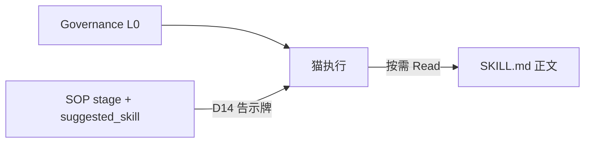
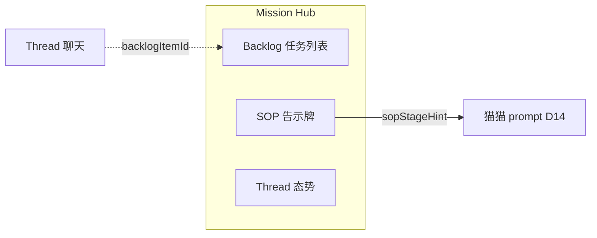

# Clowder AI 架构深度分析

> 基于 `references/clowder-ai` 源码与 `references/cat-cafe-tutorials` 教程整理。  
> 分析日期：2026-07-01

---

## 1. 参考目录总览

工作区 `references/` 包含两个关联项目：

| 目录 | 性质 | 说明 |
|------|------|------|
| **clowder-ai** | 完整源码 | pnpm monorepo，生产级多 Agent 协作平台 |
| **cat-cafe-tutorials** | 教程文档 | 16 课复盘 + 研究笔记，无应用源码 |

关系：教程记录真实演进与踩坑；源码是开源实现。教程讲「为什么」，源码是「怎么做」。

### 1.1 项目定位

Clowder AI（内部 npm 名 `cat-cafe`）要解决的核心问题：**人类不再当「人肉路由器」**——让 Claude / Codex / Gemini 等 Agent 在持久身份、共享记忆、协作纪律下真正组队，而不是在聊天窗口间复制粘贴。

三层原则：

| 层级 | 负责 | 不负责 |
|------|------|--------|
| **模型层** | 理解、推理、生成 | 长期记忆、执行纪律 |
| **Agent CLI 层** | 工具、文件、命令 | 团队协作、跨角色 review |
| **平台层（Clowder）** | 身份、路由、SOP、审计 | 推理本身 |

> 模型给能力上限，平台给行为下限。

---

## 2. Monorepo 结构

**技术栈**：Node ≥ 24、pnpm 9、TypeScript 5.3、Fastify、Next.js 14、Redis、SQLite、Biome、Vitest。

```
clowder-ai/
├── packages/
│   ├── api/           # 主后端 @cat-cafe/api
│   ├── web/           # 前端 @cat-cafe/web
│   ├── shared/        # 共享类型 @cat-cafe/shared
│   ├── mcp-server/    # MCP stdio 服务
│   └── finance/       # 金融数据查询库
├── cat-cafe-skills/   # Skills 内容（SKILL.md）
├── sop-definitions/   # SOP 机器真相源（YAML）
├── scripts/           # 启动、门禁、运维
├── docs/              # ADR、Feature 规格
└── desktop/           # Electron 桌面壳
```

### 2.1 各包职责

| 包 | 职责 |
|---|---|
| **api** | Fastify + Socket.IO；路由、领域逻辑、CLI 调用、WebSocket、连接器、记忆索引 |
| **web** | Next.js 控制台：聊天、Hub、Mission Hub、Memory 面板 |
| **shared** | 跨包类型、Zod Schema、CatRegistry、Redis 工具 |
| **mcp-server** | 暴露 `cat_cafe_*` MCP 工具，桥接 CLI ↔ API callback |
| **finance** | 金融事实查询，供 MCP 使用 |

依赖方向：`web` / `api` / `mcp-server` → `shared`；`mcp-server` 通过 HTTP callback 回连 `api`。

### 2.2 API 启动序列（简化）

```
Telemetry → Fastify + Auth → SocketManager → Redis（可选）
  → Store Factories（Thread / Message / SessionChain / ...）
  → AgentRegistry + AgentRouter
  → InvocationQueue + QueueProcessor
  → Memory Services（SQLite evidence）
  → 80+ routes → listen
```

**Store 工厂模式**：`ports/*.ts` 定义接口，`redis/` 实现；无 Redis 时降级内存。

---

## 3. Agent 调用：CLI 子进程 + MCP 回传

**ADR-001** 决策：默认路径为 **CLI 子进程 + MCP 回传**，非 SDK 直连。

| 原因 | 说明 |
|------|------|
| 订阅额度 | SDK 只能用 API key；CLI 可用 Max/Plus/Pro 订阅 |
| 完整能力 | CLI 保留文件、命令、MCP 工具 |
| 程序化集成 | MCP callback 弥补缺口 |

各猫 CLI 映射：

| 猫 | CLI |
|---|---|
| 布偶猫 (Claude) | `claude --output-format stream-json` |
| 缅因猫 (Codex) | `codex exec --json` |
| 暹罗猫 (Gemini) | `gemini --acp` 或 `agy --print`（Antigravity） |

### 3.1 端到端调用流

```
POST /api/messages
  → 写 MessageStore，创建 InvocationRecord + callbackToken
  → 202 立即返回（写入与执行解耦，ADR-008）
  → 后台 AgentRouter.routeExecution()
      → invokeSingleCat()
          → SessionManager 取 CLI sessionId
          → SystemPromptBuilder 组装 prompt
          → AgentService.invoke() → spawnCli()
          → 注入 MCP 环境变量（invocationId, callbackToken）
          → 解析 NDJSON 流 → yield AgentMessage
  → MessageStore 存回复 + Socket.IO 推送
  → QueueProcessor 处理后续队列
```

关键模块：

| 模块 | 路径 |
|------|------|
| CLI Spawn | `packages/api/src/utils/cli-spawn.ts` |
| 单猫调用 | `packages/api/src/domains/cats/services/agents/invocation/invoke-single-cat.ts` |
| 路由核心 | `packages/api/src/domains/cats/services/agents/routing/AgentRouter.ts` |
| Invocation 鉴权 | `packages/api/src/domains/cats/services/agents/invocation/InvocationRegistry.ts` |

F159 允许 opt-in native provider（API 直连），但 CLI 仍是默认主路径。

---

## 4. 路由：U2A 与 A2A

### 4.1 用户侧 @mention（U2A）

`AgentRouter` 职责：

- **有 @** → 路由到指定猫，更新 thread participants
- **无 @** → fallback 到最近回复猫（F078），或分页回看最近 5 条 user message 的 mentions（F194）
- **Intent 分流**：`ideate` + 多猫 → `routeParallel`；`execute` 或单猫 → `routeSerial`

### 4.2 猫侧 A2A（Agent-to-Agent）

猫回复中的行首 `@mention` 触发 A2A，经 **F27 统一 worklist 单路径** 处理（见第 5 节）。

防护机制：

- `MAX_A2A_DEPTH`（默认 15）
- `MAX_A2A_MENTION_TARGETS = 2`
- Ping-Pong 检测：A↔B 来回 ≥2 警告，≥4 阻断

---

## 5. A2A Worklist 单路径

### 5.1 「单路径」指什么

**F27 之前**：猫通过 MCP `cat_cafe_post_message` 回传并 `@` 另一只猫时，系统会**再开一条独立的 `routeExecution`**，导致双路径触发、子 invocation 不受父级约束、无限递归。

**F27 之后**：`@mention` 只往**父 invocation 的 worklist** 追加目标，由同一个 `routeSerial` 的 `while` 循环继续执行。

```
用户消息 → routeSerial 启动
  → registerWorklist(list=[A, B, ...])
  → while (index < worklist.length)     ← 只有这一条执行循环
      → 猫 A 完成 / MCP 回传 @C
      → pushToWorklist(C)               ← 不新开 routeExecution
      → 继续执行 C
```

### 5.2 Worklist 作用域：per-invocation，非 per-thread

| 维度 | 关系 |
|------|------|
| **主键** | `parentInvocationId`（F108）；未传则退化为 `threadId`（兼容） |
| **一个 invocation** | 恰好 **1 个** worklist |
| **一个 thread** | 可有 **0～N 个** worklist（并发 invocation） |
| **生命周期** | `routeSerial` 开始时 `registerWorklist`，结束时 `unregisterWorklist` |

Registry 结构：

```
registry: Map<parentInvocationId, WorklistEntry>
threadIndex: Map<threadId, Set<parentInvocationId>>   // 仅用于 hasWorklist(threadId)
```

### 5.3 两条 A2A 注入通道，汇入同一 worklist

| 入口 | 时机 | 机制 |
|------|------|------|
| **内联** | 某只猫执行完，检查回复里的 `@mention` | `route-serial` 直接追加 |
| **Callback** | 猫执行中用 MCP `post_message` 发 `@mention` | `pushToWorklist(..., parentInvocationId)` |

Callback 有 caller 校验：只有**当前正在执行的那只猫**才能 push，防止 stale callback 污染新 invocation。

### 5.4 WorklistEntry 核心字段

- `list: CatId[]` — 可增长的猫 ID 队列
- `executedIndex` — 当前执行位置
- `a2aCount` / `maxDepth` — 深度限制
- `a2aFrom` / `a2aTriggerMessageId` — 谁 @ 了谁、触发消息 ID
- `streakPair` — ping-pong 检测

---

## 6. Session / Thread 五概念模型（ADR-020）

```
Connector Binding → Thread → Session Chain (per cat)
                          → Active Slot
                          → CLI Resume mapping
```

| 概念 | 说明 |
|------|------|
| **Thread** | 共享聊天室：title、participants、routing policy |
| **Message** | 消息归属 thread |
| **Session Chain** | 每猫每 thread 的 session 序列（seq 0→1→2…） |
| **Active Slot** | 每猫每 thread 最多 1 个 active session |
| **CLI Session** | `userId:catId:threadId` → CLI sessionId |

**关键隔离**：Session 按 `threadId` 隔离（修复跨 thread 污染 bug）。

还有 **Delivery Cursor**（Redis 原子游标）：`delivery-cursor`、`mention-ack`、`seen-cursor`。

---

## 7. MCP 回调桥

```
API 创建 invocation → 签发 { invocationId, callbackToken }
  → 环境变量注入 CLI 子进程
  → CLI 加载 mcp-server（stdio）
  → 猫调用 cat_cafe_post_message 等写工具
  → mcp-server → POST /api/callbacks/*
  → 验证 token → 写 MessageStore → 触发 A2A → Socket.IO 推送
```

安全：每次 invocation 独立 token（TTL 2h）；`CAT_CAFE_READONLY=true` 时仅只读工具白名单。

---

## 8. 记忆与知识系统

```
docs/*.md（真相源）→ Scanner → IndexBuilder → evidence.sqlite
  ├── evidence_fts (FTS5 BM25)
  ├── evidence_vectors (vec0, dim=768)
  ├── edges（知识图谱）
  └── summary_segments（LSM 摘要）
```

检索：lexical（BM25）、semantic（vec0）、hybrid（RRF 融合）。

### 8.1 数据存储

| 存储 | 用途 |
|------|------|
| **Redis** | Thread、Message、Session、Invocation Auth、WorkflowSop 等运行时状态 |
| **SQLite** | evidence.sqlite、event-memory.sqlite、world.sqlite |

Redis 可选，无则全内存降级。WorkflowSop 存于 `workflow:sop:{backlogItemId}`。

---

## 9. Skills、SOP、Governance 三层分工

不是重复系统，而是回答不同问题：

| 层 | 回答什么 | 类比 | 真相源 |
|---|---|---|---|
| **Governance** | 永远不能违反的底线？ | 公司铁律 | `governance-pack.ts` → CLAUDE.md/AGENTS.md |
| **SOP** | Feature 现在在哪个阶段？ | 项目看板 | `sop-definitions/development.yaml` |
| **Skills** | 这个阶段具体怎么做？ | 操作手册 | `cat-cafe-skills/*/SKILL.md` |

### 9.1 衔接关系



- SOP 每个 stage 有 `suggested_skill`（如 `impl` → `writing-plans`，`quality_gate` → `quality-gate`）
- `resolveWorkflowSopSkill()` 将 stage 映射到 skill 名
- Skill 文首注释回溯 SOP 位置（如 quality-gate 标明对应 `quality_gate` stage）
- Governance 约束全局行为（含「每 workflow step 前 load 对应 skill」）

### 9.2 为什么要分开

1. **信息密度**：Governance 常驻 L0；SOP 一行告示；Skill 动辄数百行，按需加载
2. **变更频率**：Governance 平台维护；SOP 流程设计；Skill 操作细节频繁迭代
3. **作用域**：Governance 全局；SOP 绑 backlog item；Skill 还有独立能力（browser-automation 等）
4. **机器可执行性**：SOP `hard_rules` 带 `predicate`（git_state、command_pattern、manual_only 等）

### 9.3 SOP 阶段流水线（development）

```
kickoff → impl → quality_gate → [fresh_context] → review → merge → completion
```

---

## 10. Mission Hub（作战中枢）

### 10.1 是什么

**Mission Hub** 是 Feature 治理面板，路由 `/mission-hub`（组件 `MissionControlPage`）。

解决：**团队同时在做什么、做到哪一步、球在谁手上**。



核心模块：

| 模块 | 作用 |
|------|------|
| **Backlog** | Feature 任务：`open → suggested → approved → dispatched → done` |
| **SOP 告示牌** | 每 backlog 项的 `WorkflowSop`（阶段、接力棒、resume capsule、checks） |
| **Thread 态势** | 聊天线程与 backlog 关联 |
| **需求审计** | PRD 拆意图卡、风险检测 |

### 10.2 WorkflowSop 数据结构

```typescript
// packages/shared/src/types/workflow-sop.ts
interface WorkflowSop {
  featureId: string;
  backlogItemId: string;
  stage: SopStage;           // kickoff | impl | quality_gate | ...
  batonHolder: string;       // 接力棒在谁手上
  nextSkill: string | null;  // 手动 override，null 则用 definition suggested_skill
  resumeCapsule: { goal, done[], currentFocus };
  checks: {
    remoteMainSynced, qualityGatePassed,
    reviewApproved, visionGuardDone  // attested | verified | unknown
  };
  version: number;           // CAS 乐观锁
}
```

**告示牌哲学**（F073）：存信息，不控制流程。猫看了自己决定行动。

### 10.3 SOP stage 怎么推进

**系统不会自动跳转 stage。** 没有强制状态机。

推进方式：

1. 猫判断该进入下一阶段
2. 猫调用 MCP `cat_cafe_update_workflow`
3. 下一棒从 Hub / `get_thread_context` / prompt D14 看到新 stage

写入路径：

```
cat_cafe_update_workflow → POST /api/callbacks/update-workflow-sop
  → WorkflowSopStore.upsert (Redis CAS)
  → Mission Hub WorkflowSopPanel 刷新
  → route-serial 读 stage → sopStageHint 注入 prompt
```

人类也可通过 `PUT /api/backlog/:itemId/workflow-sop` 更新。

**API 不校验 stage 顺序**——顺序靠 skill + 文化 + 少量硬门禁。

### 10.4 impl → quality_gate 触发条件

| 层级 | 条件 |
|------|------|
| **文档** | `docs/SOP.md`：impl（writing-plans → worktree → tdd）完成后进入 quality-gate |
| **Skill** | `quality-gate` triggers：「开发完了」「准备 review」「自检」「声称完成」 |
| **行为** | 猫自认实现完成，**在声称「做完了」之前**先跑 quality-gate 自检 |
| **告示牌** | 猫 `cat_cafe_update_workflow({ stage: "quality_gate", resumeCapsule: {...} })` |

impl 阶段 hard_rules（如 worktree 前 main 同步）在**开 worktree 时**由 skill/脚本拦截，不是在 stage 更新时检查。

quality_gate 完成后通常：

1. `checks.qualityGatePassed: "attested"`
2. `stage: "review"`，加载 `request-review` skill

### 10.5 Backlog status 与 WorkflowSop.stage

两套独立状态：

| 系统 | 状态 | 谁改 |
|------|------|------|
| **BacklogItem.status** | open / dispatched / done | 派发、完成时 API |
| **WorkflowSop.stage** | kickoff / impl / quality_gate / ... | 猫 MCP 或人类 API |

---

## 11. 前端架构要点

**技术栈**：Next.js 14、React 18、Tailwind、Zustand、Socket.IO。

**Bubble Pipeline（F183）**：

```
Socket.IO agent_message → chatStore → bubble-reducer → UI 投影
```

主要路由：`(chat)/`、`memory/`、`mission-control/`（即 Mission Hub）、`signals/`。

---

## 12. 设计模式与扩展点

| 模式 | 应用 |
|------|------|
| Factory + Port/Adapter | Store 可 Redis/内存切换 |
| Registry | Agent、Invocation、Plugin、Worklist |
| Async Generator | `invoke()` 流式 yield |
| Composition Root | `index.ts` 集中装配 |

| 扩展点 | 入口 |
|--------|------|
| 新 AI Provider | 实现 `AgentService` → `AgentRegistry` |
| 新 MCP 工具 | `mcp-server/src/tools/` |
| 新 Skill | `cat-cafe-skills/` + `skill-manage` |
| 新 SOP 域 | `sop-definitions/*.yaml` + codegen |

---

## 13. 教程与源码对照

`cat-cafe-tutorials` 记录真实踩坑，对应源码模块：

| 教程 | 源码/ADR |
|------|----------|
| SDK→CLI 选型 | ADR-001、`cli-spawn.ts` |
| CLI 工程化 | stderr 处理、`sanitize-cli-stderr.ts` |
| 元规则 | `AGENTS.md`、governance |
| A2A 路由 | `AgentRouter.ts`、`a2a-mentions.ts` |
| MCP 回传 | `mcp-server`、`callbacks.ts` |
| 生产事故 | Redis 隔离、防腐门 |
| Session 管理 | ADR-020、SessionManager |
| 知识管理 | `domains/memory/` |
| SOP 告示牌 | F073、WorkflowSopStore |

---

## 14. 关键设计决策摘要

1. **CLI-first 而非 SDK-first** — 订阅额度 + 完整 agent 能力
2. **消息写入与执行解耦** — 202 + background invocation
3. **Thread 共享语义 + Session per-cat 隔离** — 防跨 thread 污染
4. **A2A worklist 单路径（F27）** — 消除 callback 双路径递归
5. **告示牌而非状态机（F073）** — 外化上下文，不外包判断力
6. **Skills/SOP/Governance 三层** — 底线 / 阶段 / 操作分工
7. **SOP 机器化** — YAML predicate + codegen，human doc 为叙事补充

---

## 附录：术语表

| 术语 | 含义 |
|------|------|
| **CVO** | 首席愿景官 — 平台中心的人类角色 |
| **Clowder** | 英语「一群猫」的专属量词 |
| **告示牌** | WorkflowSop 信息共享面板，非流程控制器 |
| **Resume Capsule** | 冷启动 30 秒接上活的结构化摘要 |
| **Baton** | 接力棒 — 当前持棒猫（batonHolder） |
| **attested / verified** | 猫声明 vs 系统验证 |
| **单路径** | A2A 不新开 invocation，只扩展父 worklist |